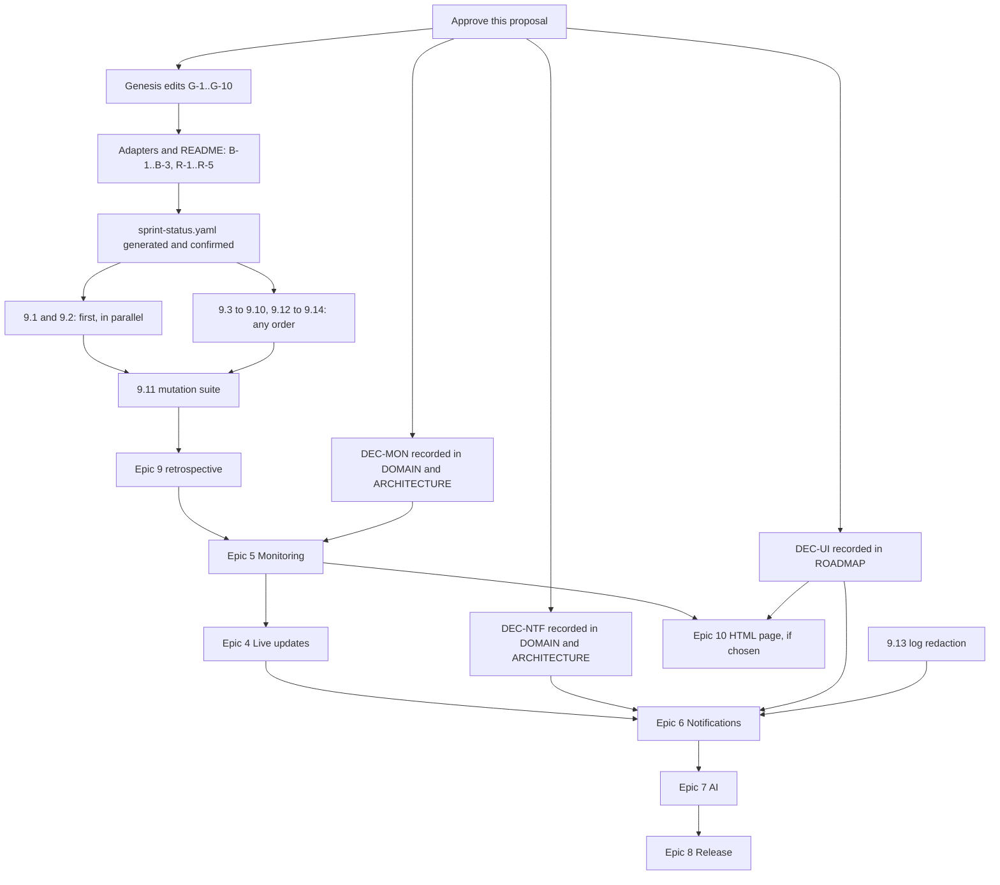

# Sprint change proposal — stabilize, decide, then monitor

> **Status: approved 2026-10-06 by Mohammed Sanaullah.** The owner also decided:
> - **DEC-UI: option A, API-only** (§4.1).
> - **DEC-MON and DEC-NTF: the recommendations in §4.2 and §4.3 are accepted as written.** They are recorded in DOMAIN.md and ARCHITECTURE.md (G-11).
> - **Historical status:** the owner delegated verification of the inferred `done` statuses to Claude, which checked them against merge commits, test files and the retrospectives' verdicts (§5.6).
>
> Genesis edits go to their owning documents before anything that depends on them.

## How to read this

The first section says what changes if you approve, in plain terms. The rest supplies the evidence, the decisions only you can make, the exact proposed edits, and how we will know each step is finished.

### Terms used

| Term | Meaning here |
|---|---|
| **Epic / story** | An epic is a user-visible outcome, such as "automated monitoring". A story is one reviewable change toward it, usually one pull request. Their numbers are **names, not positions**: Epic 9 can be delivered before Epic 4. |
| **Genesis** | `docs/genesis/`, the specification of record. A decision changes there first, in the document that owns it. |
| **Adapter** | `PRD.md` and `Architecture.md` in `planning-artifacts/`. They exist so BMAD tools have inputs, and they point at Genesis rather than restating it. |
| **Sprint tracking** | `docs/bmad/implementation-artifacts/sprint-status.yaml`, one file giving each epic, story and open action item a status. It does not exist today. |
| **Build spec** | `docs/bmad/implementation-artifacts/spec-<story>.md`, the approved contract for one story, written by `bmad-build` before any code. None exist today. |
| **Validation** | Refusing bad input, such as an empty name or a slug with spaces, before it is stored. |
| **Rate limit** | A cap on how many requests one client address may make in a time window. Past the cap, the server answers 429 "Too Many Requests". |
| **Session cookie** | What a browser sends to prove someone signed in. A `Cookie` header can carry anything, so its presence proves nothing until the session it names is looked up. |
| **In-process event bus** | How one part of a running program tells another that something happened, inside a single process. Fast, but the message is gone if the process dies. |
| **Backplane / LISTEN/NOTIFY** | Postgres's built-in way for one process (`worker`) to signal another (`api`). WatchDog plans to use it for live updates. A missed signal is not resent, so it is not durable. |
| **SSE / subscriptions** | Ways to push live updates to a browser (SSE) or an admin GraphQL client (subscriptions). |
| **Durable** | Survives a crash. A durable notification is still sent if the process restarts at the wrong moment. |
| **At-least-once** | A delivery promise: every message is sent, and occasionally twice. Exactly-once is not achievable over email. |
| **Outbox / ledger** | A table that records work still to be done (outbox) or work already done (ledger), so a restart can pick up where it left off. |
| **Reconciliation pass** | The worker periodically recomputes what should be true and fixes what drifted. WatchDog already does this for service status. |
| **Partition** | A large table split into smaller physical tables by date, so old months can be dropped cheaply. |
| **SSRF** | Server-side request forgery: tricking a server into fetching an address it should not reach, such as its own database. A monitor that fetches any URL a tenant types is exposed to it. |
| **RLS** | Row-level security. Postgres hides every other organization's rows from each request. It is WatchDog's tenant boundary. |

---

## 0. What changes if you approve

**In one sentence:** pause feature work for one short milestone that fixes two confirmed defects and makes the documents tell the truth; record three decisions; then build monitoring next, ahead of live updates.

### The delivery plan at a glance

| Order | Milestone | Outcome you can observe | Gate to leave it |
|---:|---|---|---|
| 0 | **Plan repair** (documents only) | README says what runs today. One `sprint-status.yaml` shows every story's status. Epic 9's stories exist. | This proposal approved; Genesis edits merged; tracking file generated and validated. |
| 1 | **Epic 9: Stabilization** | GraphQL refuses the same bad input REST refuses. A junk cookie no longer skips the anonymous rate limit. An admin client can reopen everything it can edit. The worker's health check fails when the worker stops working. | Must-stories 9.1–9.11 merged; both audit reproductions re-run and failing to reproduce; Epic 9 retrospective done. |
| — | **Three decisions** (in parallel with milestone 1) | DEC-UI: is v1 API-only or does it include a browser page? DEC-MON: the rules monitoring needs. DEC-NTF: how notifications survive a crash. | Each recorded in its owning Genesis document. |
| 2 | **Epic 5: Monitoring** (moved ahead of Epic 4) | Checks run, results are stored, 90-day uptime fills in, repeated failures open a draft incident. | DEC-MON recorded; Epic 5 stories approved. |
| 3 | **Epic 4: Live updates** | Public SSE and admin subscriptions, with the worker's monitoring events as the real cross-process case. | — |
| 3′ | ~~Epic 10: Public HTML page~~ | Not planned: DEC-UI chose API-only (2026-10-06). | — |
| 4 | **Epic 6: Notifications** | Email to confirmed subscribers, RSS/Atom, subscribe flow. | DEC-NTF and DEC-UI recorded; 9.13 (log redaction) merged. |
| 5 | **Epic 7: AI**, then **Epic 8: Release readiness** | Unchanged in scope. | Unchanged. |

**What stays the same:** every completed story ID (1.1–1.2, 2.1–2.19, 3.1–3.4), the Epic 2 and Epic 3 retrospectives word for word, epic numbers 1–8, and the architecture strengths the audit says to keep. That includes RLS, the restricted runtime role, tenant-aware foreign keys, module boundaries and one handler shared by both API surfaces.

---

## 1. Issue summary

### Problem statement

Three of the project's Epics are delivered and well-tested. Before Epic 4 can start safely, four problems need fixing:

1. **Two confirmed defects** on the surfaces that already exist:
   - **F-01:** GraphQL stores input that REST refuses.
   - **F-02:** a junk cookie bypasses the anonymous GraphQL rate limit.
2. **Documentation presents the destination as the present.** The README lists monitoring, real-time, notifications and AI as features, and lists four module directories that do not exist.
3. **The product's identity is undecided.** The plan says v1 ships no UI. The README and the product name say "status page". So "finished" has two incompatible meanings.
4. **Planning lost its ledger.** There is no `sprint-status.yaml` and there are no per-story specs. Status is rebuilt from git history and long retrospective prose. Epics 4–8 are one-paragraph summaries.

**Category** (checklist 1.2): mostly a *failed approach requiring a different solution* (F-01, F-02), plus a *misunderstanding of original requirements* (FR17 "renders" read two ways), plus process debt.

### How it was discovered

An external audit of commit `40b1350` on 2026-10-05, written up in `watchdog-learnings/project/09-audit-findings.md`. It reproduced F-01 and F-02 against the production-built containers. This proposal re-checked the code on `a639847`:

| Finding | Still present at `a639847` | Evidence |
|---|---|---|
| F-01 | Yes | `create-service.graphql-schema.ts` declares only `String`, `Int` and `ID`. `create-service.handler.ts` calls `assertNoNullFields` and nothing that checks length, format or range. The same holds for every handler under `src/modules/*/commands/`: they guard nulls and dates, not ranges or patterns. |
| F-02 | Yes | `src/server/index.ts:51-56`: a request is anonymous only when `!request.headers.cookie`. |
| F-04 | Yes | `README.md:19-37` lists planned features under "Features". `README.md:55` says the worker "runs background monitoring, … rollups, retention, and notification work". `README.md:141-147` lists `organization/`, `monitoring/`, `notification/` and `ai/`, none of which exists in `src/modules/`. |
| Missing ledger | Yes | `docs/bmad/implementation-artifacts/` holds two retrospectives and nothing else. Both retrospectives say tracking could not run for this reason (Epic 3 retro, "Sprint tracking"). |

### Checklist record

| Item | Status | Note |
|---|---|---|
| 1.1 Trigger | [x] | No single story. The audit of Epics 1–3 is the trigger. |
| 1.2 Problem | [x] | Above. |
| 1.3 Evidence | [x] | Above, re-checked on the current branch. |
| 2.1 Current epic | [N/A] | No epic is in progress. Epic 3 is `accepted-with-open-items`. |
| 2.2 Epic-level changes | [!] | A new Epic 9. Epic 5 moves ahead of Epic 4. Epic 10 is conditional. See §5.4–5.5. |
| 2.3 Remaining epics | [!] | Epics 4, 5 and 6 gain prerequisites (§5.5). |
| 2.4 Obsolete or new epics | [x] | None obsolete. Epic 9 is new, and Epic 10 only if DEC-UI chooses it. |
| 2.5 Order | [!] | New order: 9 → 5 → 4 → (10) → 6 → 7 → 8. |
| 3.1 PRD | [!] | Stale status lines, a broken owner reference, and the six-phase wording (§5.2). |
| 3.2 Architecture | [!] | Five sections change in ARCHITECTURE.md and three in DOMAIN.md (§5.1). |
| 3.3 UI/UX | [!] | No UX document exists. Whether one is needed is DEC-UI. |
| 3.4 Other artifacts | [!] | README, the wireframe header, worker healthcheck, CI (Epic 8). |
| 4.1 Direct adjustment | Viable | Low effort, low risk. |
| 4.2 Rollback | Not viable | Nothing completed is wrong enough to revert. Every defect is additive to fix. |
| 4.3 MVP review | Partly | Scope is unchanged except through DEC-UI, which may add a browser page. |
| 4.4 Path | [x] | Hybrid: direct adjustment plus resequencing, with one scope decision (DEC-UI). |
| 5.1–5.5 Proposal components | [x] | §1–§7 of this file. |
| 6.1–6.2 Review | [x] | Done by the author. Your review is the next step. |
| 6.3 Approval | [x] | Approved 2026-10-06. |
| 6.4 sprint-status.yaml | [x] | Generated after approval (§5.6). |
| 6.5 Handoff | [x] | §7. |

---

## 2. Impact analysis

### Epic impact

| Epic | Impact |
|---|---|
| 1–3 (done) | None to their stories or retrospectives. Four open retrospective items are absorbed into Epic 9 (see §5.6, `action_items`). |
| 4 Live updates | Moves after Epic 5. It must also carry worker-originated events and apply DOMAIN's public-page visibility rule in its event gate (DOMAIN "Public status page", last paragraph). |
| 5 Monitoring | Moves next, after Epic 9. Gains eight prerequisite decisions (DEC-MON). |
| 6 Notifications | Gains a hard gate: DEC-NTF and DEC-UI recorded before delivery code. Also depends on 9.13 (log redaction). |
| 7 AI, 8 Release | Unchanged. Epic 8 inherits F-10, F-11, F-14, F-15 and F-18 code (see §5.4, "Not in Epic 9"). |
| 9 Stabilization | New. |
| 10 Public HTML page | Conditional on DEC-UI. |

### Story impact

No completed story changes. Fourteen new stories are proposed (9.1–9.14): eleven must and three should.

### Artifact conflicts

| Artifact | Conflict | Proposed edit |
|---|---|---|
| ROADMAP §2 | Says monitoring depends on the backplane. It does not (see §4.2). | G-1 |
| ROADMAP §1 | FR17 "renders" is ambiguous. FR27's verification does not require GraphQL to refuse what REST refuses. NFR29 does not require honest health. | G-2, G-3, G-4 |
| ARCHITECTURE §5.4.1 | Records the defective rule: "requests arriving with no session cookie". | G-5 |
| ARCHITECTURE §7.1 | Says where field *names* must agree, not where *rules* are enforced. | G-6 |
| ARCHITECTURE §8 | Claims "a wedged loop fails the check", which F-08 shows is false. | G-7 |
| ARCHITECTURE §7 | Better Auth's pool has no lifecycle owner. | G-8 |
| DOMAIN, Better-Auth-owned references | Slug rule at creation is an open question. | G-9 |
| DOMAIN:975 | Still calls D-4 open. DOMAIN:180 and :1243 closed it on 2026-09-23. | G-10 |
| PRD | Points at `docs/genesis/README.md`, which does not exist. FR1 says "Partial" although #10 closed it. Status lines duplicate tracking. Its epic-seed rationale contradicts G-1. | B-1 |
| Architecture.md adapter | Its "Already implemented" list is a stale status tracker. | B-2 |
| epics.md | NFR30 "E2E not wired" is stale since story 3.4. No Epic 9. Order and prerequisites missing. | B-3 |
| README | Planned features shown as current. RLS called "defense in depth" when it is the only boundary (Epic 3 retro item 24). | R-1 to R-5 |
| Wireframe header | "v1 ships no UI" depends on DEC-UI. | W-1 |

### Technical impact

Epic 9's code changes:
- **Validation:** handler-level validation in three modules.
- **Rate limit:** one hook in `src/server/index.ts`.
- **Slug rule:** one Better Auth hook.
- **Admin reads:** two new query slices (service groups, incident detail).
- **Shutdown and health:** one sort key, one pool close, a worker health file format and healthcheck.
- **Tests:** a GraphQL mutation test suite with a structural guard.
- **Should-stories:** one new migration (9.14), plus small changes to the public route and the database logger.

No schema change is needed for the must-stories. No deployment or infrastructure change is needed.

---

## 3. Recommended approach

**Hybrid: direct adjustment plus resequencing, with one scope decision deferred to you (DEC-UI).**

- **Why not rollback:** every defect is a missing check or a missing read. Reverting Epics 2–3 would discard working, tested behaviour to fix additive gaps.
- **Why not a full MVP replan:** the v1 Definition of Done is sound. What it lacks is a sharper verification line in three rows (G-2 to G-4) and a decision about who reads the page (DEC-UI).
- **Why stabilize first:** Epic 4 adds long-lived anonymous connections, Epic 5 adds a busy worker, and Epic 6 adds anonymous sign-ups. Each builds directly on the surfaces F-01 and F-02 weaken and on the worker F-08 cannot see into.
- **Why monitoring before live updates:** see §4.2. Monitoring needs no backplane, it is the stated priority, and building it first gives Epic 4 the worker-originated events that prove the backplane works.

| | Effort | Risk | Note |
|---|---|---|---|
| Milestone 0 | Low: two documentation pull requests | Low | No code. |
| Epic 9 must-stories | Medium: 11 stories, mostly small | Low | 9.1/9.3/9.4 may change error responses that a GraphQL client relied on. There is no external client today. |
| Decisions | Low to medium: three sessions | Medium | DEC-NTF is the one most expensive to get wrong later. |
| Resequencing | None | Low | Epic numbers do not change, so no Genesis reference breaks. |

**On calendar time:** this proposal makes no promise. Each story ends at an approved spec and a merged, green pull request, at whatever pace you review.

---

## 4. Decisions only you can make

Each decision names its owning Genesis document, when it is needed, the options, and a recommendation. A recommendation is advice, not a decision.

### 4.1 DEC-UI — API-only, or a browser page? Public, admin, or both?

> **Decided 2026-10-06 by Mohammed Sanaullah: option A, API-only.** v1 serves JSON and GraphQL only, with no public or admin browser UI. Apply the "under A" variants of G-2, W-1 and B-3. Epic 10 is not created. Under DEC-NTF N8, confirm and unsubscribe links land on API endpoints that answer in plain text. The analysis below is kept as the record of what was weighed.

**Owner:** `ROADMAP.md` (§1 FR17 row, §4 non-goals) first. Then the wireframe header, README, PRD, epics, and ARCHITECTURE if HTML is served.
**Needed before:** Epic 6 stories (the subscribe flow sends people links to click) and any HTML work. **Not** needed before Epic 9 or Epic 5.

**What exists today:** `/status/:orgSlug` returns JSON, and `publicStatusPage` returns the same over GraphQL. There is no HTML anywhere. Admins work through REST, GraphQL, Swagger at `/api-docs`, and the seed.

**Questions to answer first:**
1. In v1, who reads the status page: a person in a browser, or a program someone else writes?
2. Will anyone other than you build a UI on this API?
3. Is v1 mainly a portfolio piece? The README says "backend-first portfolio implementation". If so, what must a reviewer be able to *see*?
4. When a visitor clicks "confirm subscription" in an email (FR21), what should open?

| Option | What v1 includes | What it costs | What it changes |
|---|---|---|---|
| **A. API-only** | JSON and GraphQL only. Integrators build any UI. | Least. | FR17 says "returns", not "renders". README stops implying a page. FR21's confirm and unsubscribe links land on API endpoints that answer plain text. A non-goal row "Browser UI" is added. |
| **B. Public page only** (recommended) | A server-rendered, read-only HTML page at `/status/:orgSlug` for browsers, the same JSON for programs, and later SSE for live refresh. Admins stay on API, Swagger and GraphiQL. | One epic (Epic 10): HTML escaping, a Content-Security-Policy, accessibility, how one URL serves both HTML and JSON (ARCHITECTURE decides), and a UX contract via `bmad-ux`. The wireframe stops being throwaway. | FR17 "renders" becomes literal. Subscribe and confirm pages have somewhere to live. A non-goal row "Admin UI" is added. |
| **C. Public page and admin UI** | B, plus a browser dashboard for operators. | Large: at least two epics. Forms for 17 mutations, sign-in in the browser (Better Auth cookies, the Origin check), subscriptions in the browser, and a front-end toolchain. | Effectively a second product. Pushes Epics 6–8 back. |
| **D. API-only plus a demo renderer** | A, plus a small example page kept outside the contract. | Small, but the page is unowned and drifts. | Not recommended: it recreates the "looks finished, isn't" problem. |

**Recommendation: B.**
- It makes "status page" true for the one audience the name promises, visitors.
- It gives FR21's confirmation links a home.
- It reuses the payload and wireframe Epic 3 already designed.
- Admin UI is the larger and less valuable half for a backend-first v1.
- If B is chosen, deliver Epic 10 after Epic 5, so the uptime bars it draws have data.

**Either way, Epic 9 and milestone 0 are unaffected.** The README correction (R-1) is written to be true under any option.

### 4.2 DEC-MON — what monitoring needs decided first, and what it does not

**The question you asked:** which event and backplane work must come before monitoring?

**Answer: none of the backplane.**
- Monitoring runs in the `worker` process. The worker builds the same application instance as the API (`src/worker.ts`, `buildApp`), so the in-process event bus already delivers inside it.
- Checks, stored results, draft incidents and status recomputation can therefore all happen inside the worker.
- There is a working precedent: maintenance windows already start and complete in the worker, and that already changes service status and the public page without any backplane (story 2.15, story 2.17).
- **What you give up until Epic 4:** an admin sees a new draft incident on the next read rather than live, and the public page reflects a monitor-driven status on its next fetch. That is how maintenance-driven status already behaves.

**What must precede monitoring is a set of rules nobody has written down yet.** Each goes into its owner before any Epic 5 story:

| # | Decision | Owner | Why it blocks Epic 5 | Recommendation |
|---|---|---|---|---|
| M1 | **How monitor results become `healthy` / `degraded` / `failing`.** DOMAIN defines `statusFromMonitorState` but never how the state is derived, nor what a service with several monitors shows. | DOMAIN, Status model | The recomputation handler passes `monitorState: null` today and cannot be finished without this. | Derive from stored rows only, so reconciliation can recompute it. Per monitor: `healthy` at 0 consecutive failures, `degraded` below threshold, `failing` at or above. Per service: worst of its enabled monitors. No monitors means no input. |
| M2 | **How a draft incident gets created across modules.** DOMAIN's pseudocode (`DOMAIN.md:1161-1201`) has monitoring call `repo.incidents.createDraftFromMonitor` and `repo.events.append`. That is a cross-module write and an outbox that does not exist, and both contradict the module rules. | DOMAIN, Consecutive-failure rule | The pseudocode cannot be implemented as written. | The `incident` module handles `monitor.threshold_breached` from `src/shared/events/`. The worker pass also reconciles: any monitor at threshold with no open draft gets one. The partial unique index keeps this idempotent. Rewrite the pseudocode. |
| M3 | **What triggers recomputation.** DOMAIN lists `monitor.check_succeeded` and `monitor.check_failed`, so every check would lock and recompute every live service in the organization. | DOMAIN, Status recomputation | Lock contention with operators' writes, scaling with check frequency. Overlaps the open D-2 (doubled recomputes). | Trigger on a monitor's *derived state changing*, not on every check. |
| M4 | **RLS on partitions.** Each monthly partition is its own table carrying `org_id`, and the default privileges grant `watchdog_app` access to it directly. | DOMAIN, `check_results` partitioning | `tenant-rls-coverage` will fail, rightly, unless each partition is policied or the runtime role cannot address partitions directly. | Decide one, and make the coverage test assert it. |
| M5 | **Who may create and drop partitions.** `watchdog_app` is not the table owner and cannot run DDL. ARCHITECTURE §4 gives partition maintenance to the worker. | ARCHITECTURE §6.1 | The worker cannot do the job it is assigned. | Narrow `SECURITY DEFINER` functions owned by `watchdog_owner` (create the next month, drop expired), with only `EXECUTE` granted to `watchdog_app`. Owner credentials never reach the worker. |
| M6 | **Which targets a monitor may reach (SSRF).** A tenant-typed URL is fetched from inside the Compose network, where `postgres:5432`, `mailpit` and cloud metadata addresses are reachable. | ARCHITECTURE (new subsection) and DOMAIN (target validation) | A tenant could probe or attack the host's own services. Not covered anywhere today. | Refuse loopback, private and link-local addresses by default, with an explicit environment allowlist for self-hosters who monitor internal services. Check the resolved IP at connect time, cap redirects, and cap body size for keyword checks. |
| M7 | **How checks are scheduled.** Checks are network calls with timeouts. Running them inside today's single-flight per-organization pass lets one slow tenant delay everyone's maintenance transitions. | ARCHITECTURE §6.0 | Shapes the worker loop that every Epic 5 story extends. | A separate loop with a concurrency cap and per-monitor due times (`last_checked_at + interval_seconds`), still enumerating tenants as §6.0 describes. |
| M8 | **`check_results` is append-only.** `AGENTS.md` already requires revoking `UPDATE` and `DELETE`. Record that dropping a partition is owner DDL (M5), not a row delete. | DOMAIN, CheckResult | Avoids a migration that later has to be loosened. | As stated. |

**Also triggered by Epic 5:** Epic 3 retro item 23 (the foreign-table allowlist test) fires on "the next story that adds a foreign-table read". The uptime story, where `status-page` reads `uptime_rollups`, is that story.

### 4.3 DEC-NTF — notification durability, recorded before any delivery code

**Owner:** DOMAIN for entities, ladders and events. ARCHITECTURE for the trigger, retries and worker loop.
**Needed before:** any Epic 6 story is written.

**The problem in plain terms:**
- Today an event exists only in memory, and the backplane is a signal that is not resent (ARCHITECTURE §5.1 says so: "not a durable job queue").
- If notifications were triggered by events alone, a process restart at the wrong moment would silently lose a customer email, and nothing would notice.
- Epic 2 already met this failure mode for service status and fixed it with a reconciliation pass (R-7). Notifications need the same thinking up front.

| # | Decision | Options | Recommendation |
|---|---|---|---|
| N1 | **What guarantees a notifiable change produces a notification?** | (a) Event or NOTIFY only: not durable, rejected. (b) A transactional outbox: every command writes its events to a table in the same transaction. General, and would also give Epic 4 replay, but touches every command and changes ARCHITECTURE's emission model. (c) Derive notifications from durable public history: the worker reads `incident_updates` (already append-only, written in the same transaction as each transition) and maintenance timestamps since a per-organization cursor. | **(c)** for v1. Events and NOTIFY stay as wake-up hints for lower latency, not as the trigger. Revisit (b) if Epic 4 needs replay. |
| N2 | **Delivery promise.** | At-least-once or at-most-once. | At-least-once, deduplicated on our side. State plainly that SMTP cannot give exactly-once. |
| N3 | **A delivery ledger entity.** | e.g. `notification_deliveries(org_id, subscriber_id, source_type, source_id, status, attempts, next_attempt_at, last_error, sent_at)`, with a unique key on `(subscriber_id, source_type, source_id)`. | Yes. Status as a `text` ladder with `CHECK` (`pending`, `sent`, `failed`, `abandoned`). RLS forced. Tenant-aware foreign keys. |
| N4 | **Retries.** | Backoff schedule, maximum attempts, and which SMTP answers are permanent (5xx) versus transient (4xx, network). | Write the table in ARCHITECTURE, with values in `src/config`. |
| N5 | **What notifies, and who may see it.** | Which changes send an email. | Every public timeline entry (the declaration, each public transition, posted updates, the resolution), plus maintenance scheduled, started and completed. Apply DOMAIN's "Public status page" rule *at send time*: no email for an incident naming only private services, and never for a draft-era entry. |
| N6 | **Concurrency and shutdown.** | How the worker claims work. | Claim with `for update skip locked`. A pass never overlaps itself. Shutdown waits for sends in flight, as for status today. |
| N7 | **Anonymous subscribe safety.** | — | The subscribe route inherits ARCHITECTURE §5.4.1's four bounds, plus a per-address throttle on confirmation emails so the form cannot be used to mail-bomb someone. Tokens stay hashed (DOMAIN already has the columns) with an expiry. Add a `List-Unsubscribe` header. |
| N8 | **Where confirm and unsubscribe links land.** | Depends on DEC-UI. | Plain-text endpoint under A; an HTML page under B or C. |
| N9 | **Subscriber addresses never reach logs.** | — | Requires 9.13 (F-16) merged first. |
| N10 | **Retention** of delivery rows and unsubscribed subscribers. | — | A number in DOMAIN beside the existing retention defaults. |
| N11 | **How the worker finds work across tenants.** | The O(organizations) pass of ARCHITECTURE §6.0, or the tenant-agnostic queue table §6.0 itself mentions. | The O(organizations) pass, unchanged, unless measurement says otherwise. |

**Completion criterion:** N1–N11 are written into DOMAIN and ARCHITECTURE, each Epic 6 story cites the decision it implements, and no file exists under `src/modules/notification/` before then.

### 4.4 Smaller decisions folded into this proposal

| Decision | Recommendation | Owner |
|---|---|---|
| Number the stabilization epic | **Epic 9**, keeping 1–8 unchanged. Renumbering would break dozens of Genesis references ("Epic 4 must apply this rule…", "Epic 5's rollups"). The tracking tool requires numeric epic IDs (`sprint_plan.py`, `EPIC_RE`). | epics.md |
| Tooling order trap | `sprint_plan.py` sorts epics numerically and recommends the first backlog story. Write stories for **one epic at a time**, the next only when the current one closes. Otherwise Epic 4 or 5 stories would be recommended ahead of Epic 9's. | Process (§7) |
| Trusted-proxy topology (F-18) | Record today's behaviour now (G-5); change code in Epic 8. | ARCHITECTURE §5.4.1 |
| Pagination for the new admin lists (F-14) | 9.5 returns an unbounded list and its spec records why (an organization has tens of groups). The pagination policy is decided in Epic 8, before any list becomes an external contract. | Story 9.5 spec |
| CQRS context middleware (F-15) | No change. Context stays at the protocol edges, as built. Do not add a second bus middleware until composition is proven (audit F-15). | None now |

---

## 5. Detailed change proposals

Order of application, per `AGENTS.md`: Genesis owner edits (§5.1) → adapters (§5.2) → README and wireframe (§5.3) → epics (§5.4–5.5) → tracking (§5.6). The edits that depend on a decision are marked, and are applied only once the decision is made.

### 5.1 Genesis (owner documents first)

#### G-1 · ROADMAP §2 Phased Milestones — add stabilization, correct phase 5's rationale, state delivery order

OLD (rows 4 and 5, `ROADMAP.md:50-51`):
```
| 4. Real-time backplane | In-process domain events, Postgres `LISTEN/NOTIFY` bridge, public SSE, admin GraphQL subscriptions. | Real-time delivery depends on stable domain events and must work across `api` and `worker` processes. |
| 5. Monitoring worker + uptime rollups | Worker entrypoint, HTTP(S)/TCP/keyword/SSL checks, check-result partitions, partition retention, daily rollups, draft auto-incidents. | Monitoring depends on services and the event/backplane foundation; draft incidents depend on incident workflows. |
```

NEW (rows 4 and 5, plus a stabilization row after phase 3 and a sentence under the table):
```
| Stabilization (after 3) | Input rules that hold on both API surfaces, anonymous-surface bounds that no header can skip, one organization slug rule, the admin reads a client needs to reopen what it can edit, deterministic admin ordering, clean shutdown, worker health that reflects completed work, GraphQL coverage of every mutation, and documentation that separates current from planned. | Phase 3 shipped two surfaces that accept different input and a bound a junk cookie skipped (audit 2026-10-05, F-01, F-02). Every later phase builds on those surfaces. |
| 4. Real-time backplane | In-process domain events, Postgres `LISTEN/NOTIFY` bridge, public SSE, admin GraphQL subscriptions. | Real-time delivery depends on stable domain events and must work across `api` and `worker` processes. Built after phase 5, whose worker-originated events are the cross-process case the bridge exists for. |
| 5. Monitoring worker + uptime rollups | Worker entrypoint, HTTP(S)/TCP/keyword/SSL checks, check-result partitions, partition retention, daily rollups, draft auto-incidents. | Monitoring depends on services and incident workflows. It does not depend on the backplane: checks, results, drafts and status recomputation all run inside the worker, whose in-process bus delivers, as maintenance transitions already do. Until phase 4, a monitor-driven change reaches admins and the public page on their next read. |

Phase numbers are names. Delivery order is 1, 2, 3, stabilization, 5, 4, 6.
```

#### G-2 · ROADMAP §1 FR17 row and §4 non-goals — *depends on DEC-UI*

OLD (`ROADMAP.md:27`):
```
| Public status page | `/status/:orgSlug` renders the organization's services, active incidents, scheduled maintenance, and uptime history. | E2E tests cover public route rendering by org slug. |
```

NEW under **A**:
```
| Public status page | `/status/:orgSlug` returns one JSON document carrying the organization's services, active incidents, scheduled maintenance, and uptime history, for an integrator to render. v1 serves no HTML. | E2E tests cover the public route by org slug. |
```
plus a §4 row: `| Browser UI, public or admin | v1 is an API; integrators render the page. | ROADMAP.md |`

NEW under **B**:
```
| Public status page | `/status/:orgSlug` serves a browser a read-only HTML page, and an integrator the same content as JSON, showing the organization's services, active incidents, scheduled maintenance, and uptime history. | E2E tests cover both representations by org slug; the HTML escapes every operator-written field and carries a Content-Security-Policy. |
```
plus a §4 row: `| Admin UI | Operators use REST, GraphQL and Swagger in v1. | ROADMAP.md |`

NEW under **C**: B's row, plus a new DoD row for the admin dashboard written with the PM. No non-goal row.

#### G-3 · ROADMAP §1 GraphQL API row — make "parity" include refusals

OLD (`ROADMAP.md:37`):
```
| GraphQL API | GraphQL queries/mutations/subscriptions cover admin workflows. | GraphQL integration tests cover protocol parity with REST where applicable. |
```
NEW:
```
| GraphQL API | GraphQL queries/mutations/subscriptions cover admin workflows, including the reads a client needs to reopen everything it can edit. | GraphQL integration tests cover protocol parity with REST where applicable: every mutation is exercised over GraphQL, and GraphQL refuses each input the REST schema refuses. |
```

#### G-4 · ROADMAP §1 Docker Compose row — health and shutdown are part of "runs"

OLD (`ROADMAP.md:39`, verification column): `Fresh clone can start the full stack with documented commands.`
NEW: `Fresh clone can start the full stack with documented commands. Each healthcheck fails when its process stops doing its work, not only when it exits, and api and worker shut down without forcing exit.`

#### G-5 · ARCHITECTURE §5.4.1 — the anonymous rate limit keys on a valid session, not a header

OLD (`ARCHITECTURE.md:388`, first two sentences of the bullet):
```
- **A rate limit by client IP.** `@fastify/rate-limit`, registered with `global: false`, so a surface opts in: the page through its route's `config.rateLimit`, and `/graphql` through an `onRequest` hook for requests arriving with no session cookie. An operator's own traffic is not rationed.
```
NEW:
```
- **A rate limit by client IP.** `@fastify/rate-limit`, registered with `global: false`, so a surface opts in: the page through its route's `config.rateLimit`, and `/graphql` through an `onRequest` hook for every request that does not carry a valid session. The exemption is decided by resolving the session, never by the presence of a `Cookie` header: a junk, expired or forged cookie is anonymous and is rationed like none at all (audit 2026-10-05, F-02). Every GraphQL transport the server accepts is bounded the same way. An operator's own traffic is not rationed. The limiter keys on the socket address and `trustProxy` is off, so behind a reverse proxy every caller shares the proxy's bucket; a supported proxy topology is a deployment decision recorded here when one is defined (F-18).
```
(The rest of the bullet is unchanged.)

#### G-6 · ARCHITECTURE §7.1 — rules are enforced where both surfaces arrive

ADD after the paragraph ending "…SDL cannot express them." (`ARCHITECTURE.md:760`):
```
**Rules have one source and both surfaces apply it.** Field names agreeing is not inputs being judged alike: SDL types a slug as `String`, so a value REST's schema refuses reached the handler over GraphQL and was stored (audit 2026-10-05, F-01). Every length, format and range rule is written once, in the slice's TypeBox request schema, and the handler applies it, so both surfaces refuse the same value with the same `ArgumentInvalidException`. REST's route validation stays as early feedback, not as the only check. The parity contract below compares names; the behavioural tests per mutation required by ROADMAP's GraphQL row compare refusals.
```
*Spec check for story 9.1:* confirm that dependency-cruiser allows a handler to import its own slice's `.schema.ts`. If it does not, the rule source moves to `domain/` and this paragraph names that location instead.

#### G-7 · ARCHITECTURE §8 — the worker healthcheck must reflect completed passes

OLD (`ARCHITECTURE.md:792`):
```
- `worker` serves no HTTP, so its healthcheck runs `node dist/healthcheck.js`, which asserts the heartbeat file is recent. A wedged loop fails the check rather than passing because the process still exists.
```
NEW:
```
- `worker` serves no HTTP, so its healthcheck runs `node dist/healthcheck.js`, which asserts that the last *completed* pass is recent. A heartbeat timer proves only that the event loop turns: a pass waiting on a promise that never settles leaves the timer firing and every later tick skipped (audit F-08). The worker records when each pass starts and completes, and the check fails once completion is overdue by more than the configured threshold.
```

#### G-8 · ARCHITECTURE §7 — Better Auth's pool has a lifecycle owner

ADD a third bullet under "Two consequences worth stating plainly" (`ARCHITECTURE.md:746-749`), and change "Two" to "Three":
```
- Better Auth's `pg` pool is closed by the application that opened it: an `onClose` hook ends it after the event bus drains, so `app.close()` releases every connection the process holds, and no entrypoint or script forces exit to escape an open pool (audit F-07).
```

#### G-9 · DOMAIN, Better-Auth-owned references — one slug rule at creation and lookup

OLD (last sentence of `DOMAIN.md:39`):
```
Better Auth itself accepts any non-empty slug at creation, so until creation applies the same rule (Epic 3 retrospective, open question on R-8), an organization created with a slug outside it has no reachable public page.
```
NEW:
```
Creating an organization, and changing its slug, apply the same rule: Better Auth's organization hooks refuse a slug outside it, so every organization created from then on has a reachable page (Epic 3 retrospective R-8; audit F-05). Organizations created before the hooks keep their slugs, and story 9.3 records how many exist and what they show. Renaming with slug history stays out of scope until the product can rename one.
```

#### G-10 · DOMAIN "Public status page" — remove the stale D-4 parenthesis

OLD (inside `DOMAIN.md:975`): `…and nothing stops an update being posted to a draft (Epic 2's D-4 is the open question of whether anything should), so before this rule…`
NEW: `…and an update may be posted to a draft (decided 2026-09-23, closing Epic 2's D-4; see IncidentUpdate), so before this rule…`

This is a wording fix inside the owner document. The decision already exists at `DOMAIN.md:180` and `:1243`.

#### G-11 · DOMAIN and ARCHITECTURE — DEC-MON and DEC-NTF records

These are not drafted here. They are the output of the two decision sessions in §4.2 and §4.3. Each lands as a dated section in its owner, in the same style as the "Public status page" section ("Decided 2026-…"). G-11 is complete when M1–M8 and N1–N11 each have a sentence in their owner, and DOMAIN's monitoring pseudocode (`:1161-1201`) and its recomputation trigger list (`:928-933`) match M2 and M3.

### 5.2 BMAD adapters

#### B-1 · PRD.md

1. **Broken owner reference.** OLD (`PRD.md:17`): `` - `docs/genesis/README.md` owns the pitch, stack and scope. `` NEW: `` - `README.md` at the repository root owns the pitch and stack; `docs/genesis/ROADMAP.md` owns what v1 includes, excludes, and the order it is delivered in. ``
2. **Status lives elsewhere.** ADD after `PRD.md:19`: `This file records requirements, not progress. What is built is tracked in docs/bmad/implementation-artifacts/sprint-status.yaml and evidenced by tests.`
3. **Remove every `Current status:` line.** These are FR1 (stale: says "Partial", but #10 closed it), FR2, FR3, NFR29, NFR30 (stale: E2E is wired since story 3.4) and NFR31 (`PRD.md:36, 43, 50, 209, 216, 223`).
4. **Epic seeds rationale.** OLD (`PRD.md:227`): `Epics follow ROADMAP's six phases verbatim. The ordering is load-bearing: tenant isolation precedes any tenant data, the domain precedes the API surfaces that expose it, real-time precedes the worker that feeds it, and monitoring precedes the draft incidents it generates.` NEW: `Epics derive from ROADMAP's phases: phase 6 is split into Epics 6–8, and Epic 9 is the stabilization milestone. Delivery order is ROADMAP §2's, not the epic numbers'. Tenant isolation precedes tenant data, the domain precedes the surfaces that expose it, stabilization precedes new features, and monitoring precedes both the draft incidents it creates and the real-time bridge that carries its events.` Then replace the duplicated phase table under it with a pointer to ROADMAP §2.
5. **Frontmatter.** ADD `kind: genesis-adapter` and `validated: 2026-10-06`. Keep `stepsCompleted` for the tooling.

#### B-2 · Architecture.md (adapter)

1. REPLACE the "Already implemented" section (`Architecture.md:37-46`) with: `What is built is tracked in docs/bmad/implementation-artifacts/sprint-status.yaml and evidenced by tests. This file lists only settled decisions and the constraints every story inherits.`
2. ADD to "Constraints that shape every story", after story 9.2 merges: `A Cookie header is not a session. Anything that treats a caller as authenticated resolves the session first.` After 9.1 merges: `A handler applies its slice's input rules itself; REST validation is early feedback, not the only check.`
3. Frontmatter as B-1.5.

#### B-3 · epics.md (planning edits; the story text is in §5.4)

1. **NFR30 status.** OLD (`epics.md:56`): `- **PARTIAL**: Partial - check, database and docker jobs run. Cucumber E2E and k6 smoke are not wired yet.` NEW: `- **PARTIAL**: check, database, E2E and docker jobs run; k6 smoke is not wired (ARCHITECTURE §9) and the built image is never booted (Epic 3 retro item 21). Closed in Epic 8.`
2. **FR coverage map.** ADD `Epic 9 — stabilization; adds no FR, re-verifies FR4, FR6, FR27 and NFR29 against ROADMAP's sharpened lines (G-3, G-4)`. Under DEC-UI B or C, change FR17's line to `Epic 3 (payload) and Epic 10 (HTML page)`.
3. **Epic List.** ADD at the top: `Delivery order: 1, 2, 3, 9, 5, 4, 6, 7, 8 (and 10 after 5, if DEC-UI chooses it). Numbers are names; ROADMAP §2 owns the order.`
4. **UX Design Requirements** (`epics.md:90-92`). *Depends on DEC-UI.* Under A: unchanged. Under B or C: `None until Epic 10, whose first story produces the UX contract with bmad-ux; the Epic 3 wireframe is its input.`
5. **Epic 3 summary** (`epics.md:153`): `v1 ships no UI` becomes `the payload is the contract any renderer uses (see DEC-UI)`.

### 5.3 README and wireframe

#### R-1 · Add a "Current status" section directly after the opening paragraph (`README.md:3`)

```
## Current status

WatchDog is being built in phases (see ROADMAP.md). As of 2026-10-06:

- **Runs today:** sign-up, organizations and active-org switching (Better Auth); services, groups, archive/restore and manual overrides; incidents with an append-only timeline; scheduled maintenance that starts and completes on time; one effective status per service; the public status payload as JSON at `/status/:orgSlug` and GraphQL `publicStatusPage`; the admin REST and GraphQL API with Swagger at `/api-docs`; a demo seed.
- **Planned for v1, not built yet:** synthetic monitoring and draft auto-incidents; 90-day uptime data (the field exists and is empty); live updates over SSE and GraphQL subscriptions; email notifications, RSS/Atom and the subscribe flow; AI assistance.
- **Progress:** docs/bmad/implementation-artifacts/sprint-status.yaml.
```

#### R-2 · Retitle "## Features" (`README.md:5`) as "## v1 scope"

Tag each subsection heading **(built)** or **(planned)**:
- built: Tenancy/Auth, Services & Status, Incidents & Maintenance
- planned: Monitoring, Real-time, Notifications, Agentic-AI
- Public Page: built (JSON payload); live updates and uptime data planned

#### R-3 · Architecture at a glance (`README.md:55`)

1. OLD: `while \`worker\` runs background monitoring, maintenance transitions, rollups, retention, and notification work.` NEW: `while \`worker\` runs maintenance transitions and status reconciliation today, and takes on monitoring, rollups, retention and notification work as those phases land.`
2. OLD: `with Postgres RLS as defense in depth.` NEW: `and Postgres RLS is the tenant boundary: no repository adds its own \`org_id\` predicate, so \`api\` and \`worker\` refuse to start as a role RLS does not bind.` This closes the second half of Epic 3 retro item 24.

#### R-4 · Repo layout (`README.md:140-148`)

List the modules that exist: `service/`, `incident/`, `maintenance/`, `status-page/`. Add `src/server/auth/` (organization context) and `src/shared/`. Move `monitoring/`, `notification/` and `ai/` to a line reading `# planned: monitoring/, notification/, ai/`. Remove `organization/`, which does not exist; organization context lives in `src/server/auth/`.

#### R-5 · Scope (`README.md:162`)

OLD: `- v1 is a single-compose, backend-first portfolio implementation covering tenancy, …` NEW: `- v1 targets a single-compose, backend-first portfolio implementation covering tenancy, … See Current status for what exists today.`

#### W-1 · Wireframe header — *depends on DEC-UI*

Under A, unchanged. Under B or C, OLD (`public-status-wireframe.md:3-11`, "This is a constraint, not a frontend. v1 ships no UI…") becomes NEW: `Story 3.1 drew this as a constraint on the payload. With ROADMAP's FR17 now requiring a human-readable page, it is the input to Epic 10's UX contract; the payload trace below stays authoritative for the JSON representation.`

### 5.4 New Epic 9 — Stabilization (to append to epics.md)

```markdown
## Epic 9: Stabilization

The surfaces Epics 2 and 3 built hold under input and headers nobody tested: GraphQL refuses what REST refuses, the anonymous limit cannot be skipped, an admin client can reopen what it edits, and the worker's health says whether it is working.

**FRs covered:** none new. Re-verifies FR4, FR6, FR27 and NFR29 against ROADMAP's sharpened lines, and ARCHITECTURE 5.4.1.

**Delivered before Epics 4–8.** Stories 9.1 and 9.2 come first and may run in parallel. 9.11 follows 9.1, 9.3 and 9.4, because its refusal cases need theirs. The rest are independent.

> Constraint 1 (one module per story) is why F-01 is three stories: 9.1 service, 9.3 incident, 9.4 maintenance. 9.11 is test-only and drives the app over HTTP, importing no module, the same exception `src/shared/api/input-validation.integration.test.ts` already makes.
```

Each story below is in the epics.md format. The `Satisfies:` lines cite the sharpened ROADMAP lines (G-3, G-4) or the amended ARCHITECTURE and DOMAIN sections (G-5 to G-9).

#### Story 9.1: GraphQL refuses what REST refuses — services and groups (F-01, part 1 of 3) · **must**

As an operator using GraphQL,
I want the same input rules REST applies,
So that I cannot store a service the REST API would have refused.

**Actor:** human · **Satisfies:** FR27 verification (G-3), "GraphQL refuses each input the REST schema refuses"; ARCHITECTURE §7.1 (G-6) · **Files:** `src/shared/validation/`, the `.handler.ts` of `create-service`, `update-service`, `create-service-group`, `update-service-group` and `set-status-override` under `src/modules/service/commands/`, plus a GraphQL refusal test · **Verification layer:** integration

**Given** the audit's reproduction, `createService` over GraphQL with `name: ""`, `slug: "INVALID SLUG!"` and `displayOrder: -1`
**When** it is sent
**Then** it is refused with a client error the GraphQL formatter passes through, not "Internal Server Error"
**And** no row is written and no `service.created` is emitted

**Given** each rule in the service slice's TypeBox request schemas (name length, slug pattern and length, non-negative order, UUID group id, the override ladder)
**When** a value breaking it reaches the matching mutation over GraphQL
**Then** it is refused exactly where REST refuses it, one test per rule

**Given** a valid input
**When** it is sent over both surfaces
**Then** both persist equivalent rows

**Given** the rules
**When** the story lands
**Then** each rule is written once and both surfaces apply that one definition, with no hand-copied second version in the handler

#### Story 9.2: The anonymous GraphQL limit holds whatever cookie arrives (F-02) · **must**

As an operator running WatchDog,
I want the anonymous GraphQL rate limit to hold for every request without a valid session,
So that a junk `Cookie` header cannot remove the bound on my public surface.

**Actor:** human (the operator who relies on the bound) · **Satisfies:** ARCHITECTURE §5.4.1 (G-5) · **Files:** `src/server/index.ts`, `src/modules/status-page/public-surface-bounds.integration.test.ts`, `AGENTS.md` (Epic 3 lesson P2: the convention lands with the change) · **Verification layer:** integration

**Given** the anonymous bucket is exhausted for one client address
**When** the next `publicStatusPage` POST carries `Cookie: junk=cookie`
**Then** it is answered 429 with `Retry-After`, and the resolver is not reached

**Given** an expired or signed-out session's cookie
**When** the bucket is exhausted
**Then** the same 429

**Given** a valid operator session
**When** it makes more requests than the anonymous limit
**Then** none is rationed (the existing test, kept)

**Given** every GraphQL transport the server accepts
**When** anonymous traffic arrives over it
**Then** it is bounded the same way, or the transport is refused, and a test pins which

**Open question for the spec:** resolve the session in the hook, or apply an operation-level policy. Either satisfies G-5; the spec records the cost of a session lookup per anonymous request.

#### Story 9.3: GraphQL refuses what REST refuses — incidents (F-01, part 2 of 3) · **must**

As 9.1, for `create-incident`, `update-incident`, `transition-incident` and `post-incident-update` in `src/modules/incident/commands/`.

**Given** each rule in the incident slice's TypeBox request schemas (title and message length, impact and status ladders, UUID ids)
**When** a value breaking it reaches the matching mutation over GraphQL
**Then** it is refused as REST refuses it, with nothing written and nothing emitted

The spec opens by listing each rule the GraphQL path does not yet apply. If that list is empty, the story closes with the list and one refusal test per rule as evidence.

#### Story 9.4: GraphQL refuses what REST refuses — maintenance (F-01, part 3 of 3) · **must**

As 9.3, for `schedule-maintenance`, `update-maintenance`, `complete-maintenance` and `delete-maintenance` in `src/modules/maintenance/commands/`.

#### Story 9.5: One slug rule for organizations, at creation and lookup (F-05) · **must**

As an operator,
I want an organization's slug checked when it is created or changed,
So that every organization I create has a public page that answers.

**Actor:** human · **Satisfies:** DOMAIN, Better-Auth-owned references (G-9); Epic 3 retro item 24 · **Files:** `src/server/auth/auth.ts`, `src/shared/domain/slug.ts`, `src/server/auth/auth.integration.test.ts` · **Verification layer:** integration

**Given** creation through Better Auth with a slug outside the rule (uppercase, spaces, leading or trailing hyphen, over 120 characters)
**When** it is attempted
**Then** it is refused with a 4xx and no `"organization"` row exists

**Given** slugs at each boundary (1 character, 120 characters, hyphen-separated runs)
**When** they are created
**Then** each succeeds and `/status/<slug>` answers 200

**Given** an update that changes a slug to one outside the rule
**When** it is attempted
**Then** it is refused

**Given** the rule
**When** creation and lookup apply it
**Then** both call the one function in `src/shared/domain/slug.ts`

#### Story 9.6: Read service groups (F-03, part 1) · **must**

As an operator's client,
I want to list my organization's service groups and read one,
So that I can show and edit groups after losing local state.

**Actor:** human · **Satisfies:** FR4, and FR27 (G-3) "the reads a client needs to reopen everything it can edit" · **Files:** `src/modules/service/queries/list-service-groups/`, `.../get-service-group/` (route, resolver, schema, graphql-schema), `src/modules/service/dtos/` · **Verification layer:** integration

**Given** an organization with groups created in reverse of their expected order
**When** they are listed
**Then** they come back ordered by `display_order`, then `name`, then `id`, over REST and GraphQL alike

**Given** another organization's group id
**When** it is read
**Then** 404, not an empty result

**Given** no groups
**When** they are listed
**Then** an empty collection is returned

The parity contract compares this capability.

#### Story 9.7: Read one incident with its affected services (F-03, part 2) · **must**

As an operator's client,
I want to read an incident with its affected services and their per-service impact,
So that I can edit it without silently dropping services `updateIncident` would replace.

**Actor:** human · **Satisfies:** FR6, and FR27 (G-3) · **Files:** `src/modules/incident/queries/get-incident/`, `src/modules/incident/dtos/` (an admin detail DTO) · **Verification layer:** integration

**Given** an incident naming two services with different impacts
**When** it is read
**Then** its headline fields and `affectedServices[{serviceId, impact}]` are returned

**Given** that response
**When** it is fed back unchanged into `updateIncident`
**Then** no `incident.updated` is emitted, because nothing changed (DOMAIN, decided 2026-09-23)

**Given** a draft
**When** an admin reads it
**Then** it is returned

**Given** another organization's incident
**When** it is read
**Then** 404

**Given** both surfaces
**When** the same incident is read over each
**Then** the values are identical

#### Story 9.8: Admin service lists settle ties by id (F-06) · **must**

**Actor:** system · **Satisfies:** `AGENTS.md`, "A query whose order is part of a response ends at a unique column" · **Files:** `src/modules/service/database/service.repository.ts`, its integration test · **Verification layer:** integration

**Given** two services tied on `display_order` and `name`, created in reverse of `id` order
**When** services are listed repeatedly
**Then** they always come back in `id` order

The spec lists any other admin query found without a unique tail. Each one found becomes its own story in its own module.

#### Story 9.9: Close Better Auth's pool on shutdown (F-07) · **must**

**Actor:** system · **Satisfies:** ARCHITECTURE §7 (G-8); NFR29 (G-4) · **Files:** `src/server/auth/auth.ts`, `src/server/plugins/auth.ts`, `db/seeds/seed.ts` · **Verification layer:** integration

**Given** a built app that has served authenticated requests
**When** `app.close()` resolves
**Then** Better Auth's pool holds no connections, and it closed after the event bus drained

**Given** the seed
**When** it finishes
**Then** the process exits on its own, and the forced `process.exit` is removed

#### Story 9.10: Worker health reports completed passes (F-08) · **must**

As an operator,
I want the worker's healthcheck to fail when passes stop completing,
So that a stuck worker is restarted rather than reported healthy.

**Actor:** human · **Satisfies:** ARCHITECTURE §8 (G-7); NFR29 (G-4) · **Files:** `src/worker.ts`, `src/healthcheck.ts`, `src/config/env.ts` · **Verification layer:** integration

**Given** a pass that never settles (the test injects one)
**When** the overdue threshold passes
**Then** the healthcheck exits non-zero, although the timer still writes

**Given** passes completing normally
**When** the healthcheck runs
**Then** it passes

**Given** one pass slower than the interval but within the threshold
**When** the healthcheck runs
**Then** it still passes

**Given** a restart
**When** the first pass has not completed yet
**Then** the check allows a grace period equal to the threshold

**Open question for the spec:** also bound a pass with a statement timeout. The audit recommends one. The spec decides whether it belongs here or in M7.

#### Story 9.11: Every GraphQL mutation runs over GraphQL (F-09) · **must**

**Actor:** system · **Satisfies:** FR27 (G-3) "every mutation is exercised over GraphQL"; Epic 2 VG-4; Epic 3 retro item 22 · **Files:** `src/shared/api/graphql-mutations.integration.test.ts` (new), and helpers in `src/shared/testing/`, which also closes part of Epic 3 retro item 20 · **Verification layer:** integration · **Depends on:** 9.1, 9.3, 9.4

**Given** the merged schema's `Mutation` fields
**When** the suite runs
**Then** each has at least one success case and one meaningful refusal over GraphQL: an unauthenticated refusal, plus a validation refusal where the mutation takes input

**Given** a new mutation added without a case
**When** the suite runs
**Then** it fails and names the field, because the suite compares its registry with the schema

#### Story 9.12: Public CORS headers on every answer (F-12) · **should**

**Actor:** human (a browser on another origin) · **Satisfies:** ARCHITECTURE §5.4.1 "CORS for any origin, without credentials" · **Files:** `src/modules/status-page/queries/get-public-status-page/get-public-status-page.public.route.ts`, `public-surface-bounds.integration.test.ts` · **Verification layer:** integration

**Given** a cross-origin request
**When** it is answered 200, 304, 404 or 429
**Then** every answer carries the public CORS headers and exposes `ETag`

#### Story 9.13: SQL debug logging never prints parameter values (F-16) · **should; required before Epic 6**

**Actor:** system · **Satisfies:** AI.md §4.4, PII and log handling; DEC-NTF N9 · **Files:** `src/shared/db/postgres.ts` · **Verification layer:** unit

**Given** `LOG_LEVEL=debug`
**When** a parameterized query runs
**Then** the statement and parameter count are logged through the application logger, and no parameter value is logged

#### Story 9.14: The runtime role cannot hard-delete a service (F-17) · **should**

**Actor:** system · **Satisfies:** DOMAIN, Archive semantics, "v1 has no hard service delete" · **Files:** a new migration, never an edit to the applied grant migration; a privilege integration test · **Verification layer:** integration

**Given** `watchdog_app`
**When** it issues `delete from services`
**Then** Postgres refuses with a permission error

**Given** archive and restore
**When** they run
**Then** both still work

#### Not in Epic 9, and where each goes

| Finding | Goes to | Why |
|---|---|---|
| F-10 Swagger naming, error contract, pinned client generation | Epic 8 | Release documentation. |
| F-11 CodeQL branch, Compose boot smoke, k6 product profiles | Epic 8 (also Epic 3 retro item 21) | Release evidence. k6 needs monitoring to be worth loading (ARCHITECTURE §9). |
| F-13 Fastify validation and not-found logging | Epic 9 retrospective decides: log them, or amend `AGENTS.md` | A policy question, not a defect. |
| F-14 Pagination | Epic 8, before any list is an external contract | See §4.4. |
| F-15 Bus middleware | None now | See §4.4. |
| F-18 Trusted proxy | Recorded by G-5; code in Epic 8 | No supported proxy topology yet. |
| P3 items | Epic 9 retrospective triages them | Polish. |

### 5.5 Changes to future epics (summaries in epics.md)

ADD to **Epic 5** (after `epics.md:169`):
```
- **Delivered next, after Epic 9, and before Epic 4.** It needs no backplane (ROADMAP §2). Its stories are written only once DEC-MON M1–M8 are recorded in DOMAIN and ARCHITECTURE; see sprint-change-proposal-2026-10-06 §4.2.
- The story that fills the uptime payload is the first new foreign-table read since Epic 3, so it carries Epic 3 retro item 23, the foreign-table allowlist test.
```

ADD to **Epic 4**:
```
- Built after Epic 5, so the worker's monitor events are the real cross-process case its Compose test proves.
- Its public event gate applies DOMAIN's "Public status page" rule, not only the draft check (DOMAIN, last paragraph of that section).
- `/status/:orgSlug/events` inherits ARCHITECTURE 5.4.1's four bounds, including G-5's session rule.
```

ADD to **Epic 6**:
```
- **Gate:** no story is written until DEC-NTF N1–N11 are recorded in DOMAIN and ARCHITECTURE and DEC-UI is recorded in ROADMAP (sprint-change-proposal-2026-10-06 §4.1, §4.3). Story 9.13 must be merged.
```

ADD **Epic 10** (only under DEC-UI B or C):
```
### Epic 10: A status page a person can read
A visitor opens `/status/:orgSlug` in a browser and reads the organization's status, incidents, maintenance and uptime; an integrator still gets JSON from the same address.
**FRs covered:** FR17 (the HTML half). First story: the UX contract via bmad-ux, from the Epic 3 wireframe.
```

### 5.6 Restoring sprint tracking and per-story build specs

**How:** once this proposal is approved and §5.1–5.4 are merged, run `bmad-sprint-planning`. Its readiness gate must pass. Because no historical story files exist, use its *fix* procedure to reconcile history from git, tests and the retrospectives, and confirm every inferred `done` with you before the file is written.

**Expected result** (keys are generated by `sprint_plan.py` from story titles; the statuses are this proposal's claim, each backed by the merge commit shown):

```yaml
development_status:
  epic-1: done            # 1.1 and 1.2: #10 (5ccdb15)
  epic-1-retrospective: optional
  epic-2: done            # 2.1–2.19: #11–#29
  epic-2-retrospective: done   # epic-2-retro-2026-09-11.md, accepted-with-open-items
  epic-3: done            # 3.1–3.4: #44–#47
  epic-3-retrospective: done   # epic-3-retro-2026-09-21.md, accepted-with-open-items
  epic-4: backlog         # no stories until its turn
  epic-5: backlog         # stories after DEC-MON
  epic-6: backlog         # gated by DEC-NTF and DEC-UI
  epic-7: backlog
  epic-8: backlog
  epic-9: backlog         # 9.1–9.14 as backlog
  epic-9-retrospective: optional
```

**`action_items` carried from the retrospectives.** They are copied, not moved; the retrospectives stay as written.

| Epic | Item | Status | Where it now lives |
|---|---|---|---|
| 2 | D-1 timeline sequence column, until a bulk writer exists | open | Revisit in Epic 5 (monitors write into drafts) |
| 2 | D-2 doubled recomputes | open | DEC-MON M3 |
| 2 | D-6 a seed that fails partway | open | Deferred |
| 2 | D-7 `status=draft` without `includeDrafts` | open | Deferred |
| 3 | 20 shared test helpers | open | Partly in story 9.11 |
| 3 | 21 container smoke in CI | open | Epic 8 |
| 3 | 22 a GraphQL mutation test per command | open | Story 9.11 |
| 3 | 23 foreign-table allowlist test | open | Epic 5's uptime story |
| 3 | 24a slug rule at creation | open | Story 9.5 |
| 3 | 24b README says RLS is the boundary | open | R-3 |

**Per-story build specs from now on:**
1. Each story starts with `bmad-build`, which writes `docs/bmad/implementation-artifacts/spec-<epic>-<story>-<slug>.md` with intent, boundaries, code map, tasks, acceptance criteria and verification.
2. You approve the spec, and the implementation runs in a fresh session.
3. The build updates the story's status in `sprint-status.yaml` (`in-progress`, then `review`).
4. After code review and merge, the story is set to `done`.

A story is not started without an approved spec. A retrospective appends its action items to `sprint-status.yaml` instead of leaving them only in prose.

---

## 6. Dependencies



Notes:
- The three decisions can be made while Epic 9 is being built. They block later epics, not Epic 9.
- Epic 6 depends on Epic 4 only if DEC-NTF picks an event-driven trigger. Under the recommended option (c), the arrow from E4 to E6 is ordering preference only.

---

## 7. Implementation handoff

**Scope classification: Moderate**, meaning backlog reorganization plus a new epic. Within it, two items are **Major** and route to a planning role: DEC-UI (product, PM) and DEC-MON/DEC-NTF (Architect).

| Role | Who | Responsibility |
|---|---|---|
| Owner and approver | Mohammed | Approves this proposal, each decision, every inferred `done`, and every build spec. |
| PM (`bmad-agent-pm`) | Claude, with you | DEC-UI session; applies G-2, W-1 and the DEC-UI-dependent parts of B-3. |
| Architect (`bmad-agent-architect`) | Claude, with you | DEC-MON and DEC-NTF sessions; writes G-11 into DOMAIN and ARCHITECTURE. |
| PO / Dev (`bmad-sprint-planning`) | Claude | Applies §5.1–5.5 as documentation PRs, then generates and reconciles `sprint-status.yaml`. |
| Dev (`bmad-build`) | Claude implements; you review and merge | Epic 9, one story at a time, spec first. |

### Completion criteria

| Milestone | Done when |
|---|---|
| 0 Plan repair | G-1 and G-3 to G-10 merged. B-1, B-2 and B-3 (except the DEC-UI parts) merged. R-1 to R-5 merged. Epic 9 is in `epics.md`. `sprint-status.yaml` exists, validates (`bmad-sprint-planning` validate intent), and you confirmed every `done` in it. |
| 1 Epic 9 | Stories 9.1–9.11 are `done`, each with an approved spec, a merged PR, and `check`, `test`, `test:integration`, `auth:schema:check` and `test:e2e` passing. The audit's F-01 and F-02 reproductions, re-run against a production-built container, are refused. 9.12–9.14 are done or explicitly deferred by you. The Epic 9 retrospective has run and its items are in `action_items`. |
| DEC-UI | ROADMAP's FR17 row and non-goals say A, B or C. The dependent edits (G-2, W-1, B-3.2, B-3.4, B-3.5) are merged. |
| DEC-MON | M1–M8 are each a dated sentence in DOMAIN or ARCHITECTURE. DOMAIN's monitoring pseudocode and trigger list match them. Epic 5 stories are written, trace to those sentences, and pass the readiness gate. |
| DEC-NTF | N1–N11 are recorded. Epic 6 stories cite them. No notification module code exists before that. |
| Overall | You can explain, in two sentences, what runs today and what is planned. No open item lives only in retrospective prose. |

### What happens next, if you approve

1. I apply milestone 0 as one documentation PR: Genesis first, then adapters and README. You review it.
2. We run `bmad-sprint-planning` and you confirm the reconciled statuses.
3. `bmad-build` starts on story 9.1, stopping at its spec for your approval.
4. Separately, at your pace: the DEC-UI conversation, which needs only you, then the DEC-MON and DEC-NTF sessions.

---

## Appendix A · Owner map: every changed decision and where it lives

| Decision or correction | Owning document | Section | Edit |
|---|---|---|---|
| Stabilization phase; monitoring needs no backplane; delivery order | ROADMAP | §2 | G-1 |
| Who reads `/status/:orgSlug`; browser UI in or out | ROADMAP | §1 FR17, §4 | G-2 (DEC-UI) |
| GraphQL parity includes refusals and edit-reopening reads | ROADMAP | §1 GraphQL API | G-3 |
| Health and shutdown are part of "runs" | ROADMAP | §1 Docker Compose | G-4 |
| Anonymous limit keys on a valid session; proxy topology | ARCHITECTURE | §5.4.1 | G-5 |
| Where input rules are enforced | ARCHITECTURE | §7.1 | G-6 |
| Worker health reflects completed passes | ARCHITECTURE | §8 | G-7 |
| Better Auth pool lifecycle | ARCHITECTURE | §7 | G-8 |
| Organization slug rule at creation | DOMAIN | Better-Auth-owned references | G-9 |
| D-4 wording | DOMAIN | Public status page | G-10 |
| Monitor-derived state, draft creation, recompute triggers, partition RLS, append-only results | DOMAIN | Status model; Consecutive-failure rule; Status recomputation; Monitoring data | G-11 (DEC-MON M1–M4, M8) |
| Partition DDL privilege, target safety (SSRF), check scheduling | ARCHITECTURE | §6.1; new subsection; §6.0 | G-11 (DEC-MON M5–M7) |
| Notification trigger, ledger, retries, visibility, retention | DOMAIN and ARCHITECTURE | Subscriber and new entity; §4, §5.1, §6.0 | G-11 (DEC-NTF) |
| Product pitch and current status | README (not Genesis) | — | R-1 to R-5 |

## Appendix B · Audit findings to stories and decisions

| Finding | Priority | Disposition |
|---|---|---|
| F-01 GraphQL validation | P1 | Stories 9.1, 9.3, 9.4; G-3, G-6 |
| F-02 Anonymous rate-limit bypass | P1 | Story 9.2; G-5 |
| F-03 Admin reads | P1 | Stories 9.6, 9.7; G-3 |
| F-04 README describes planned as built | P1 | R-1 to R-5; B-1 to B-3 |
| F-05 Slug rule | P1 | Story 9.5; G-9 |
| F-06 Admin ordering | P2 | Story 9.8 |
| F-07 Better Auth pool | P2 | Story 9.9; G-8 |
| F-08 Worker health | P2 | Story 9.10; G-7 |
| F-09 GraphQL mutation coverage | P2 | Story 9.11 |
| F-10, F-11, F-14, F-18 | P2 | Epic 8 (F-18 recorded by G-5) |
| F-12 CORS on errors | P2 | Story 9.12 |
| F-13 Logging of Fastify refusals | P2 | Epic 9 retrospective |
| F-15 Bus middleware | P2 | No change now |
| F-16 SQL debug parameters | P2 | Story 9.13 (gate for Epic 6) |
| F-17 Service DELETE grant | P2 | Story 9.14 |
| P3 items | P3 | Epic 9 retrospective |
