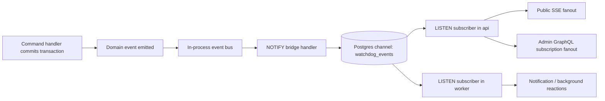

# ARCHITECTURE.md

WatchDog is a backend-first, self-hosted, multi-tenant status page platform built on the selected Fastify boilerplate constraints: TypeScript on Node 24+, Fastify 5, Awilix DI, Pino logging, CQRS, raw SQL through `postgres.js`, DBMate migrations, REST, GraphQL, SSE, and a single Docker Compose topology.

This document owns runtime architecture, CQRS/DDD/vertical-slice mapping, the two-entrypoint model, the in-process bus vs Postgres `LISTEN/NOTIFY` backplane, real-time fanout, auth-as-plugin integration, RLS enforcement mechanics, Compose topology, and CI shape. Domain entities, state machines, status-resolution rules, monitoring persistence, retention, and canonical event names are owned by [DOMAIN.md](./DOMAIN.md).

---

## 1. Architectural stance

WatchDog uses Clean Architecture, DDD, CQRS, and vertical slices because the product is naturally split into cohesive business capabilities that must remain extractable: service catalog, incidents, maintenance, monitoring, notifications, public status-page reads, and AI-assisted workflows.

The core rule is framework-agnostic business logic. Domain models, use-case handlers, repository ports, and domain events live below Fastify, Mercurius, SSE, PostgreSQL, and Better Auth. HTTP routes and GraphQL resolvers are adapters that translate protocol input into commands or queries; they do not own business decisions.

CQRS is the boundary between protocol adapters and use cases:

- Commands mutate state and emit domain events.
- Queries compose read models and return protocol-neutral DTOs.
- Planned CQRS middleware will inject authenticated user, active organization, role and request metadata. Today protocol adapters resolve organization context explicitly; tenant repositories receive a transaction with its RLS context set.
- Cross-module request-response interactions go through command/query buses.
- Cross-module fire-and-forget reactions go through the event bus.

Vertical slices live under `src/modules/<feature>/` and keep commands, queries, domain logic, database adapters, and DTOs close to the feature. Direct imports between modules are forbidden; module boundaries are crossed through buses or emitted events. This preserves the option to extract modules later without untangling framework or persistence dependencies.

```text
src/modules/<feature>/
  commands/
  queries/
  domain/
  database/
  dtos/
```

The data layer is raw SQL through `postgres.js` inside repository adapters that implement repository ports. There is no ORM. DBMate is the single migration source of truth.

---

## 2. Module topology

Event names below reference the canonical event catalog in [DOMAIN.md](./DOMAIN.md) by name only.

| Module | Responsibility | Key commands / queries | Emitted events |
|---|---|---|---|
| `organization` | Active-organization resolution, org slug lookup, org switcher data, and membership/role context through Better Auth-owned organization plugin tables. Org/team/membership mutations happen inside Better Auth; WatchDog does not own their DDL or domain events. If default WatchDog rows are later needed after org creation, use a Better Auth after-hook that calls a command directly instead of emitting a WatchDog domain event. | `ResolveOrganizationBySlugQuery`, `ListMyOrganizationsQuery`, `ResolveActiveOrganizationContextQuery`, `SwitchActiveOrganizationCommand` | None |
| `service` | Services/components, service groups, public ordering, archive/restore lifecycle, manual status override, status recomputation orchestration. | `CreateServiceCommand`, `UpdateServiceCommand`, `ArchiveServiceCommand`, `RestoreServiceCommand`, `SetManualStatusOverrideCommand`, `ClearManualStatusOverrideCommand`, `CreateServiceGroupCommand`, `UpdateServiceGroupCommand`, `DeleteServiceGroupCommand`, `ListServicesQuery`, `GetServiceQuery` | `service.created`, `service.updated`, `service.archived`, `service.restored`, `service.status_changed`, `service.manual_override_set`, `service.manual_override_cleared`, `service_group.created`, `service_group.updated`, `service_group.deleted` |
| `incident` | Incident aggregate, append-only updates, affected-service impact, lifecycle transitions, monitor-triggered draft creation and reconciliation, draft confirmation/dismissal. | `CreateIncidentCommand`, `TransitionIncidentCommand` (every move on the ladder, including confirming and dismissing a draft, and resolving), `UpdateIncidentCommand`, `PostIncidentUpdateCommand`, `ListIncidentsQuery`, `GetIncidentTimelineQuery` | `incident.created`, `incident.draft_created`, `incident.confirmed`, `incident.updated`, `incident.update_posted`, `incident.state_changed`, `incident.resolved`, `incident.dismissed` |
| `maintenance` | Scheduled maintenance windows, affected services, idempotent worker-driven lifecycle transitions. | `CreateMaintenanceCommand`, `UpdateMaintenanceCommand`, `DeleteMaintenanceCommand`, `StartDueMaintenanceCommand`, `CompleteDueMaintenanceCommand`, `ListMaintenanceQuery`, `GetMaintenanceQuery` | `maintenance.created`, `maintenance.updated`, `maintenance.started`, `maintenance.completed`, `maintenance.deleted` |
| `monitoring` | Synthetic monitor configuration, worker check execution, check result persistence, consecutive-failure tracking, derived monitor state and threshold events, uptime rollup refresh, partition maintenance. The incident module owns draft creation. | `CreateMonitorCommand`, `UpdateMonitorCommand`, `DeleteMonitorCommand` (deferred past v1), `RunDueMonitorChecksCommand`, `RecordCheckResultCommand`, `RefreshUptimeRollupsCommand`, `MaintainCheckResultPartitionsCommand`, `ListMonitorsQuery`, `GetMonitorResultsQuery` (deferred past v1) | `monitor.created`, `monitor.updated`, `monitor.deleted` (deferred past v1), `monitor.check_succeeded`, `monitor.check_failed`, `monitor.state_changed`, `monitor.recovered`, `monitor.threshold_breached`, `monitor.ssl_expiry_warning`, `uptime.rollup_refreshed` |
| `notification` | Public subscribers, confirmation/unsubscribe flow, email dispatch via Mailpit, RSS/Atom feed generation, durable-history-driven delivery through a ledger. Events only wake the worker pass. | `CreateSubscriberCommand`, `ConfirmSubscriberCommand`, `UnsubscribeCommand`, `QueueEmailNotificationCommand`, `SendQueuedEmailCommand`, `GetRssFeedQuery`, `GetAtomFeedQuery` | `subscriber.created`, `subscriber.confirmed`, `subscriber.unsubscribed`, `notification.email_queued`, `notification.email_sent`, `notification.email_failed` |
| `ai` | Provider port, incident copilot, postmortem draft, NL query over status history, weekly digest draft. All customer-facing actions stay human-in-the-loop. | `DraftIncidentUpdateCommand`, `DraftPostmortemCommand`, `DraftWeeklyDigestCommand`, `AnswerStatusHistoryQuestionQuery` | `ai.incident_update_drafted`, `ai.postmortem_drafted`, `ai.weekly_digest_drafted`, `ai.nl_query_answered` |
| `status-page` | Public per-org read side, status page payload composition, 90-day uptime payload, public SSE stream. | `GetPublicStatusPageQuery`, `GetPublicUptimeHistoryQuery`, `OpenPublicStatusEventStreamQuery` | None; consumes bridged events and read models. |
| `auth` | Not a domain module. Better Auth Fastify plugin plus explicit session/organization-context resolution outside the CQRS bus; centralized CQRS context middleware is planned. |

Decided 2026-10-09 (owner): v1 ships no monitor delete and no raw-result history read. An operator disables a monitor instead (DOMAIN, Monitor). Results are still persisted and rolled up, and `ListMonitorsQuery` is the read that lets a client reopen a monitor's configuration. `DeleteMonitorCommand`, `GetMonitorResultsQuery` and `monitor.deleted` stay in the table, marked deferred, so the planned capability is not silently dropped. `GetSession`, `RequireSession`, `ResolveRequestActor`, `ResolveActiveOrgRole` | None owned by WatchDog architecture. |

---

## 3. Request lifecycle

All REST and GraphQL entrypoints converge on the same CQRS handlers.

**Current implementation:** each authenticated route and resolver calls `resolveOrganizationContext` from `src/server/auth/organization-context.ts` and places the resolved `orgId` on the command or query payload. Public reads resolve the organization by slug. Handlers validate their inputs, and `withTenantTransaction` validates the organization id before setting the transaction-local GUC. Centralized CQRS context middleware is not implemented.

Decided 2026-10-09 (owner): v1 resolves organization context in each route and resolver, and `authenticated-surface.spec.ts` fails the build on any operation that skips it. Central middleware is a later consolidation, not a v1 requirement.

**Target design:** the middleware chain below and `RequestContext` sketch describe the intended consolidation, not the current runtime wiring.

```text
Route / Resolver
  -> request schema validation
  -> Better Auth session read
  -> pre-tenant org lookup when needed
  -> CQRS middleware
       - auth context
       - active org resolution
       - resolved org id shape validation
       - role resolution
       - command/query context injection
  -> Handler
  -> Domain model / domain service
  -> Repository port
  -> Repository adapter
       - postgres.js transaction
       - SET LOCAL app.current_org_id = '<resolved-org-id>'
       - raw SQL under RLS
  -> commit
  -> after-commit event publication
```

Protocol adapters are thin:

```text
REST route or GraphQL resolver
  parses input
  calls commandBus.execute(...) or queryBus.execute(...)
  maps result/error to protocol response
```

In the target design, tenant-context injection is explicit and mandatory. CQRS middleware resolves `session -> user -> active organization -> role` through Better Auth-owned user, organization, membership, team, invitation, and role data. After active-org resolution and before any repository sets `app.current_org_id`, the middleware validates the resolved org id against the Better Auth id format, not a UUID regex. A malformed org id is rejected with a 4xx response so a resolution bug fails loudly instead of surfacing as an empty tenant.

The planned middleware would inject a command/query context similar to:

```ts
type RequestContext = {
  requestId: string;
  userId: string | null;
  orgId: string;
  orgRole: 'owner' | 'admin' | 'member';
  isPublicRead: boolean;
};
```

Public status-page reads resolve `/status/:orgSlug` through the pre-tenant path before a GUC exists. Authenticated admin requests resolve the active organization from the session and Better Auth organization plugin membership data. After `orgId` is resolved and validated, all WatchDog tenant-scoped repository operations set `app.current_org_id` inside the transaction.

Illustrative target-context repository shape, not the implemented helper signature. The current `src/shared/db/tenant-transaction.ts` exports `withTenantTransaction(orgId, work, options)` and passes a `TenantTransaction` to each repository call. Its options support read-only, repeatable-read composition where one snapshot is required.

```ts
type TxContext = {
  sql: import('postgres').Sql;
  orgId: string;
};

function assertValidBetterAuthOrgId(orgId: string): void {
  // Use the Better Auth id contract pinned by the committed schema/migration.
  // Reject empty, malformed, or unexpected ids before RLS is reached.
}

async function withTenantTransaction<T>(
  sql: import('postgres').Sql,
  ctx: RequestContext,
  work: (tx: TxContext) => Promise<T>,
): Promise<T> {
  assertValidBetterAuthOrgId(ctx.orgId);

  return sql.begin(async tx => {
    await tx`select set_config('app.current_org_id', ${ctx.orgId}, true)`;
    return work({ sql: tx, orgId: ctx.orgId });
  });
}
```

Handlers should not accept arbitrary `orgId` from user input. The effective organization always comes from request context.

---

## 4. Two-entrypoint runtime

WatchDog builds one Docker image and runs two commands from it:

| Entrypoint | Runs | Primary responsibilities |
|---|---|---|
| `api` | Fastify HTTP server | REST API, GraphQL API, Swagger, Better Auth plugin, public status page reads, public SSE, admin GraphQL subscriptions, Postgres `LISTEN` subscriber for client fanout. |
| `worker` | Worker process | Synthetic monitor scheduler/executor, maintenance state transitions, uptime rollup refresh, check-result partition maintenance, old rollup pruning, email dispatch, background notification workflows, Postgres `LISTEN` subscriber for worker-side cross-process reactions when needed. |

**Shutdown.** Decided 2026-10-09 (owner). On SIGTERM or SIGINT, `api` and `worker` stop taking new work, finish in-flight work and event handlers, and close their database pools before terminating. The API's `graceful-server` exits the process after those steps, and that is permitted; a forced exit must never substitute for cleanup. The worker needs no exit, because once its loops stop and its pools close nothing keeps the process alive. Section 6.0 gives the worker's order and section 7 the pools. The wording does not prove the behaviour: tests of the real entrypoints' shutdown paths are still owed (`deferred-work.md`).

The image is shared so dependency graph, configuration, migrations, and module code remain identical. Runtime behavior is selected by command, for example:

```text
# development
tsx src/index.ts api
tsx src/index.ts worker

# production, after `pnpm run build`
node ./dist/index.js api
node ./dist/index.js worker
```

Resolved: the project keeps the boilerplate's `tsx` (development) and `tsc` + `resolve-tspaths` (production) toolchain rather than Node 24 native type-stripping. Native stripping cannot resolve the `@/*` tsconfig path alias at runtime and forbids `enum`, which `src/config/env.ts` uses for `NodeEnv` and `LogLevel`. The Dockerfile therefore carries a build stage.

The in-process event bus cannot be the cross-process backplane because `api` and `worker` are separate OS processes. A domain event emitted in the worker after a monitor threshold breach cannot reach SSE clients connected to the API process through memory. Worker-side notifications instead discover API-originated changes from durable history on their scheduled pass (section 5.6); cross-process events may wake that pass early but are not required for delivery.

Therefore:

- In-process bus remains for same-process handlers.
- Postgres `LISTEN/NOTIFY` is the cross-process and client-fanout backplane.
- Selected events are bridged for cross-process fanout, SSE, GraphQL subscriptions and public status updates. Notification events are optional wake-ups, never the source of delivery work.
- The worker owns partition maintenance: detach and drop expired `check_results` partitions using `CHECK_RESULTS_RETENTION_DAYS`, and prune old `uptime_rollups` using `ROLLUP_RETENTION_DAYS`.

---

## 5. Eventing and real-time

### 5.1 Bus split

| Mechanism | Scope | Use cases | Non-use cases |
|---|---|---|---|
| In-process event bus | Same process only | Local domain reactions, same-command follow-up handlers, decoupled module reactions inside `api` or inside `worker`. | API-to-worker communication, worker-to-API communication, SSE fanout, GraphQL subscription fanout. |
| Postgres `LISTEN/NOTIFY` | Cross-process | API/worker coordination, public SSE, admin GraphQL subscriptions, optional notification-pass wake-ups. | Durable job queue, large payload transport, event store. |

The in-process bus delivers one event to **every** handler registered for its type, and treats an event with no handler as a no-op. Both matter and neither was true of the boilerplate's implementation, which kept a single handler per type and threw on an unsubscribed event.

Several reactions to one event is the design here, not an edge case: the NOTIFY bridge fans an event out to clients while a module recomputes derived state from the same event. A map to one handler would let the second registration silently replace the first. And a domain event with no in-process subscriber is normal rather than an error, since most of the catalog exists to be bridged or simply to be part of the record.

**Handlers are isolated from each other and from the emitter.** Events are emitted after the emitting command commits, so no handler can undo that work, and a handler's failure must not pretend it did. The bus catches a synchronous throw or a rejected promise per handler, reports it to its `onHandlerError` (the app logs it), and still runs the handlers after it. The emitting request keeps its success response. The bus does not retry, so a handler whose work matters owns its own recovery. For status recomputation, that is the reconciliation pass the Epic 2 retrospective proposes. Before this rule, one throwing listener skipped every listener after it and turned a committed change into a 500 (retrospective R-4). The bus also tracks the promises async handlers return, so closing the app drains them: shutdown waits for handler work in flight rather than ending the connection pool underneath it.

The command and query buses hold exactly one handler per type, and registering a second throws at boot, so a copied slice that reuses a type fails loudly instead of silently replacing another handler.

Each app instance owns its command, query and event buses and its DI container, so its handlers bind to its own buses, and closing one app disposes only its own container. The Better Auth instance, its `authPool` and the postgres.js pool stay process-wide and are shared by every app in the process.

`NOTIFY` payloads are intentionally small. Subscribers re-query read models by `orgId`, `aggregateType`, and `aggregateId` under the appropriate tenant context.

### 5.2 Fanout path


```mermaid
flowchart LR
  A[Command handler commits transaction] --> B[Domain event emitted]
  B --> C[In-process event bus]
  C --> D[NOTIFY bridge handler]
  D --> E[(Postgres channel: watchdog_events)]
  E --> F[LISTEN subscriber in api]
  E --> G[LISTEN subscriber in worker]
  F --> H[Public SSE fanout]
  F --> I[Admin GraphQL subscription fanout]
  G --> J[Notification / background reactions]
```

For public surfaces, the fanout layer gates visibility using the authoritative public set from [DOMAIN.md](./DOMAIN.md). Incident events are public only after name whitelisting and only when the incident is not `draft`; the decision is based on the current read model.

### 5.3 NOTIFY bridge sketch

```ts
type DomainEventName =
  | 'service.status_changed'
  | 'service.created'
  | 'service.updated'
  | 'service.archived'
  | 'service.restored'
  | 'service.manual_override_set'
  | 'service.manual_override_cleared'
  | 'service_group.created'
  | 'service_group.updated'
  | 'service_group.deleted'
  | 'incident.created'
  | 'incident.draft_created'
  | 'incident.confirmed'
  | 'incident.updated'
  | 'incident.update_posted'
  | 'incident.state_changed'
  | 'incident.resolved'
  | 'incident.dismissed'
  | 'maintenance.created'
  | 'maintenance.updated'
  | 'maintenance.started'
  | 'maintenance.completed'
  | 'maintenance.deleted'
  | 'monitor.recovered'
  | 'monitor.threshold_breached'
  | 'monitor.ssl_expiry_warning'
  | 'uptime.rollup_refreshed';

type DomainEvent = {
  name: DomainEventName;
  orgId: string;
  aggregateType: string;
  aggregateId: string;
  occurredAt: Date;
};

const NOTIFY_CHANNEL = 'watchdog_events';

const EVENTS_TO_BRIDGE = new Set<DomainEventName>([
  'service.status_changed',
  'service.created',
  'service.updated',
  'service.archived',
  'service.restored',
  'service.manual_override_set',
  'service.manual_override_cleared',
  'service_group.created',
  'service_group.updated',
  'service_group.deleted',
  'incident.created',
  'incident.draft_created',
  'incident.confirmed',
  'incident.updated',
  'incident.update_posted',
  'incident.state_changed',
  'incident.resolved',
  'incident.dismissed',
  'maintenance.created',
  'maintenance.updated',
  'maintenance.started',
  'maintenance.completed',
  'maintenance.deleted',
  'monitor.recovered',
  'monitor.threshold_breached',
  'monitor.ssl_expiry_warning',
  'uptime.rollup_refreshed',
]);

export async function bridgeDomainEventToNotify(
  sql: import('postgres').Sql,
  event: DomainEvent,
): Promise<void> {
  if (!EVENTS_TO_BRIDGE.has(event.name)) {
    return;
  }

  await sql`
    select pg_notify(
      ${NOTIFY_CHANNEL},
      json_build_object(
        'eventName', ${event.name},
        'orgId', ${event.orgId},
        'aggregateType', ${event.aggregateType},
        'aggregateId', ${event.aggregateId},
        'occurredAt', ${event.occurredAt.toISOString()},
        'version', 1
      )::text
    )
  `;
}
```

The handler for append-only incident timeline updates keys on `incident.update_posted`. No PascalCase event names are used.

### 5.4 LISTEN subscriber sketch

**Unimplemented design sketch.** The visibility gate is deliberately left abstract: Epic 4 must apply DOMAIN's full public-status-page visibility rule inside `withTenantTransaction`, not copy a draft-only query on the global connection.

```ts
type WatchdogNotifyPayload = {
  eventName: string;
  orgId: string;
  aggregateType: string;
  aggregateId: string;
  occurredAt: string;
  version: 1;
};

type RealtimeHub = {
  publishPublic(payload: WatchdogNotifyPayload): Promise<void>;
  publishAdmin(payload: WatchdogNotifyPayload): Promise<void>;
};

const PUBLIC_EVENT_NAMES = new Set<string>([
  'service.status_changed',
  'service.created',
  'service.updated',
  'service.archived',
  'service.restored',
  'service_group.created',
  'service_group.updated',
  'service_group.deleted',
  'incident.created',
  'incident.confirmed',
  'incident.updated',
  'incident.update_posted',
  'incident.resolved',
  'maintenance.created',
  'maintenance.updated',
  'maintenance.started',
  'maintenance.completed',
  'maintenance.deleted',
]);

export async function startWatchdogEventsListener(
  sql: import('postgres').Sql,
  realtimeHub: RealtimeHub,
): Promise<void> {
  await sql.listen('watchdog_events', async rawPayload => {
    const payload = JSON.parse(rawPayload) as WatchdogNotifyPayload;

    await realtimeHub.publishAdmin(payload);

    if (await isPubliclyVisibleEvent(sql, payload)) {
      await realtimeHub.publishPublic(payload);
    }
  });
}

declare function isPubliclyVisibleEvent(
  sql: import('postgres').Sql,
  payload: WatchdogNotifyPayload,
): Promise<boolean>;
```

The public event-name whitelist is necessary but not sufficient. The gate must also enforce DOMAIN's Public status page rule: drafts are private, services must be public and unarchived, and incidents/windows naming only hidden services must not expose their data or affected-service ids. Tenant-scoped reads run inside `withTenantTransaction`; an absent row is not permission to publish. Epic 4 must define privacy-safe invalidation for deletion, archive and visibility changes, rather than assuming every event can be judged from a row that still exists. `aggregateType` never bypasses the whitelist. Draft dismissal emits `incident.dismissed` only, never `incident.resolved`.

### 5.4.1 What bounds the anonymous surface

Decided 2026-09-21 by the Epic 3 retrospective (R-5, R-15), after the first anonymous route arrived with no bound of any kind. Epic 4's `/status/:orgSlug/events` inherits all four, and an SSE connection is long-lived, so each matters more there.

- **One page per GraphQL operation.** A mercurius validation rule (`src/server/graphql-public-page-limit.ts`) counts selections of `publicStatusPage`, aliases and fragments included, and refuses a second. One 6 KB request aliasing it a hundred times ran a hundred page compositions against a pool of ten connections. REST needs no equivalent: one request is one page.
- **A rate limit by client IP.** `@fastify/rate-limit`, registered with `global: false`, so a surface opts in: the page through its route's `config.rateLimit`, and `/graphql` through an `onRequest` hook for every request that does not carry a valid session. The exemption is decided by resolving the session, never by the presence of a `Cookie` header: a junk, expired or forged cookie is anonymous and is rationed like none at all (audit 2026-10-05, F-02). Every GraphQL transport the server accepts is bounded the same way. An operator's own traffic is not rationed. The limiter keys on the socket address and `trustProxy` is off, so behind a reverse proxy every caller shares the proxy's bucket; a supported proxy topology is a deployment decision recorded here when one is defined (F-18). The limiter throws a `TooManyRequestsException`, because the error handler masks anything that is not an `ExceptionBase` and would answer 500 instead of 429. `PUBLIC_RATE_LIMIT_MAX` and `PUBLIC_RATE_LIMIT_WINDOW_MS` tune it; both default.
- **Cache validators.** `Cache-Control: public, max-age=PUBLIC_PAGE_MAX_AGE_SECONDS`, and an `ETag` over the body with `generatedAt` removed, since that field changes on every response and a tag over it could never match. A matching `If-None-Match` answers 304 with no body and no `Content-Length`.
- **CORS for any origin, without credentials.** Only on the public page, which sets the headers itself: the global registration stays `origin: false`, because a page anyone may fetch is not one any site may read with a session attached. Helmet's default `Cross-Origin-Resource-Policy: same-origin` is relaxed to `cross-origin` there, or a browser could not read the response at all, and `ETag` is exposed so a script can revalidate. `If-None-Match` is not CORS-safelisted, so the route answers the preflight too.

### 5.5 SSE handler skeleton

Public status pages use REST for initial state and SSE for live updates.

```ts
import type { FastifyInstance, FastifyReply, FastifyRequest } from 'fastify';

type PublicStatusStreamParams = {
  orgSlug: string;
};

export async function registerPublicStatusStreamRoutes(app: FastifyInstance) {
  app.get<{
    Params: PublicStatusStreamParams;
  }>('/status/:orgSlug/events', async (request, reply) => {
    const org = await app.cqrs.queryBus.execute({
      type: 'ResolveOrganizationBySlugQuery',
      slug: request.params.orgSlug,
    });

    return openStatusSseStream(request, reply, org.id);
  });
}

async function openStatusSseStream(
  request: FastifyRequest,
  reply: FastifyReply,
  orgId: string,
): Promise<void> {
  reply.raw.writeHead(200, {
    'content-type': 'text/event-stream; charset=utf-8',
    'cache-control': 'no-cache, no-transform',
    connection: 'keep-alive',
    'x-accel-buffering': 'no',
  });

  const unsubscribe = request.server.realtime.publicEvents.subscribe(
    orgId,
    event => {
      reply.raw.write(`event: ${event.eventName}\n`);
      reply.raw.write(`data: ${JSON.stringify(event)}\n\n`);
    },
  );

  request.raw.on('close', () => {
    unsubscribe();
  });
}
```

GraphQL subscriptions are admin-only and subscribe to the same API-process realtime hub after Better Auth session and active-org membership checks.

### 5.6 Notification delivery

Decided 2026-10-06 (DEC-NTF, `docs/bmad/planning-artifacts/sprint-change-proposal-2026-10-06.md`). The data model and the rule for what notifies live in DOMAIN, Notification delivery. This section owns how delivery runs.

- **Triggered by durable history, not by events.** Every public change a subscriber is told about is already recorded durably: an `incident_updates` entry, or a maintenance window's own timestamps. The worker's notification pass reads, per organization, what was recorded since its cursor and writes what each confirmed subscriber is owed to the delivery ledger. Events and `NOTIFY` may wake the pass early to cut latency. They never decide whether a notification exists, because the bus does not retry and `NOTIFY` is not resent (section 5.1). A process that dies mid-pass loses nothing: the next pass starts from the cursor, and the ledger's unique key absorbs any repeat.
- **The cursor reads with an overlap.** A transaction can commit an entry stamped earlier than one the pass has already read, so each pass re-reads a configured margin behind its cursor. The ledger's unique key makes the overlap free.
- **Delivery is at-least-once.** A delivery is marked `sent` after the SMTP server accepts it, so a crash between acceptance and that write sends it again on the next pass. Exactly-once is not achievable over SMTP, and a duplicate is preferred to a loss.
- **Claiming and concurrency.** A pass claims due ledger rows with `for update skip locked`, never overlaps itself, and on shutdown waits for sends in flight, as every pass does (section 6.0). It runs as section 6.0's O(organizations) loop; no tenant-agnostic queue is introduced.
- **Retries.** A transient failure (a network error, an SMTP 4xx) is retried with exponential backoff, from about a minute up to about an hour between attempts, until a configured maximum, then marked `abandoned`. A permanent failure (an SMTP 5xx) is marked `failed` at once. The delays and the cap live in `src/config`.
- **The anonymous subscribe route** inherits section 5.4.1's four bounds, and adds a per-address throttle on confirmation emails so the form cannot be used to mail-bomb someone. Every email carries a `List-Unsubscribe` header. v1 serves no HTML (ROADMAP, non-goals), so confirm and unsubscribe links land on API endpoints that answer in plain text.
- **Subscriber addresses never reach logs.** SQL debug logging prints no parameter values (story 9.13) before the notification module exists, and a delivery's `last_error` never contains the address.

---

## 6. Multi-tenancy enforcement

WatchDog uses a shared PostgreSQL database with tenant isolation by `org_id`. Every WatchDog tenant-scoped table carries `org_id` as a text FK to Better Auth's `organization.id`. Better Auth-owned user, session, account, verification, organization, team, membership, invitation, and role tables sit outside WatchDog tenant-scoped RLS policies.

Enforcement layers:

1. Application code never trusts `orgId` from request input.
2. Authenticated routes and resolvers resolve active org and role through `resolveOrganizationContext`; public reads use the pre-tenant slug lookup. Centralized CQRS context middleware remains planned.
3. `withTenantTransaction` validates the resolved org id shape before opening the tenant transaction; see [Request lifecycle](#3-request-lifecycle).
4. Repository operations run inside transactions.
5. Each transaction sets `SET LOCAL app.current_org_id`.
6. PostgreSQL RLS policies enforce `org_id = current_setting('app.current_org_id', true)`.
7. The app connects as a non-superuser role so RLS cannot be bypassed accidentally.
8. Table owners are not used for normal application traffic; `FORCE ROW LEVEL SECURITY` is enabled on WatchDog tenant tables.


### 6.0 How the worker finds tenant work

The `worker` entrypoint runs outside any request, so nothing has resolved an organization for it. Every WatchDog table is under RLS, and `app.current_org_id` is unset until a tenant transaction opens — so a worker query written the obvious way, scanning `maintenance` for due windows, returns nothing at all. It fails closed, silently, and a scheduler that finds no work looks exactly like a scheduler with no work to do.

**The worker enumerates tenants from Better Auth's `organization` table, then processes each under its own tenant transaction.** That table is outside WatchDog's tenant RLS by the decision in section 6.4, which makes it the one place a process with no organization can legitimately learn which organizations exist. No `BYPASSRLS` role is introduced, and `watchdog_app` needs no additional privilege: the per-organization work still runs under `withTenantTransaction` and is still scoped by policy.

```text
for each organization id in Better Auth's "organization"
  withTenantTransaction(orgId, do the pass for that tenant)
```

Two consequences worth stating rather than discovering later:

- A pass is O(organizations) transactions, whether or not a given organization has work. For a self-hosted status page that is the right trade against introducing a privileged role to ask one cross-tenant question. If it ever stops being the right trade, the answer is a tenant-agnostic queue table, not a role that can read everything.
- Each organization's pass is independent. One tenant's failure must not abandon the rest, so a pass records and continues rather than aborting.

Three rules keep a pass from damaging the process that runs it, each from a defect the Epic 2 retrospective found (R-6):

- **A pass never overlaps itself.** A tick that arrives while a pass is still running logs and skips. Two passes would contend on the same rows, fan out duplicate recomputations, and pile up on the connection pool under load.
- **Tenant discovery failing costs one pass, not the worker.** Discovery is the single query outside the per-tenant loop, so it sits inside its own guard: nothing awaits a scheduled pass, and an unhandled rejection ends the process.
- **Shutdown waits for work in flight.** On a signal the worker finishes the pass in flight, then closes the app, which drains event handlers before the connection pool closes. A deploy landing just after a transition commits would otherwise cut off the recomputation it triggered, and nothing re-emits that event.

**Every pass also reconciles.** After a tenant's scheduled work, the pass recomputes that tenant's service status through `RecomputeServiceStatusCommand`. Status recomputation is event-driven and the events are one-shot, so a handler that failed leaves a derived column wrong with nothing to re-trigger it. The recomputation is idempotent and writes nothing when the answer has not moved; a correction is logged, because it means an event was lost. See DOMAIN.md, Status recomputation.

This is the shape for every scheduled task: maintenance transitions, monitor execution, uptime rollups, partition maintenance and notification dispatch.

### 6.0.1 Monitor check scheduling

Decided 2026-10-06 (DEC-MON M7, `docs/bmad/planning-artifacts/sprint-change-proposal-2026-10-06.md`). Checks are network calls bounded only by each monitor's `timeout_seconds`, so they do not run inside the maintenance pass: one tenant's slow targets would delay every organization's maintenance transitions and reconciliation.

- The worker runs checks in a loop of their own, under the same three rules as a pass: it never overlaps itself, a tenant-discovery failure costs one tick, and shutdown waits for checks in flight.
- Each tick enumerates tenants as above. Per organization, a monitor is due when it is enabled, its service is not archived, and `last_checked_at + interval_seconds` has passed; a monitor never checked is due.
- Checks run under a process-wide concurrency cap set in `src/config`, so one organization with many monitors cannot exhaust the connection pool or the network for everyone else.
- A check that exceeds its timeout is recorded as a failure whose error code says so.

### 6.1 Role provisioning

Role creation is environment-owned, not committed migration SQL with embedded passwords.

- `watchdog_owner` owns schema and runs migrations through `DBMATE_DATABASE_URL`.
- `watchdog_app` is a login, nosuperuser runtime role used by `api`, `worker`, and tests through the app `DATABASE_URL`.
- In Docker Compose, `watchdog_app` is created by a Postgres init script mounted into `/docker-entrypoint-initdb.d/` and parameterized by environment variables.
- In CI, an explicit setup step creates `watchdog_app` with `watchdog_app_test_password` before integration tests.
- Passwords come from environment per environment and are never committed in SQL files.
- Grants may live in migrations, but they should use `ALTER DEFAULT PRIVILEGES` so future WatchDog tables and sequences auto-grant to `watchdog_app`.

Illustrative grant shape for migrations:

```sql
grant usage on schema public to watchdog_app;
grant select, insert, update, delete on all tables in schema public to watchdog_app;
grant usage, select on all sequences in schema public to watchdog_app;

alter default privileges in schema public
grant select, insert, update, delete on tables to watchdog_app;

alter default privileges in schema public
grant usage, select on sequences to watchdog_app;
```

The owner/app URL split is mandatory under `FORCE ROW LEVEL SECURITY`: migrations run as `watchdog_owner`; application traffic runs as `watchdog_app`.

**Partition maintenance without owner credentials.** Decided 2026-10-06 (DEC-MON M5). Creating `check_results` partitions and dropping expired ones is DDL, which only the table owner may run, and the worker is `watchdog_app`. The worker never receives owner credentials. Instead a migration creates two `SECURITY DEFINER` functions owned by `watchdog_owner`, each with a fixed `search_path` and no SQL beyond the partition names it computes itself: one creates the partitions for the coming months, and one detaches and drops partitions wholly older than a retention passed as an argument. `watchdog_app` is granted `EXECUTE` on those two functions and nothing more. The worker calls them each pass with `CHECK_RESULTS_RETENTION_DAYS`, and keeps at least two months of future partitions, so a worker outage across a month boundary does not refuse inserts. Each partition the function creates gets the treatment DOMAIN's partitioning section requires. Within a pass, uptime rollup refresh and catch-up (DOMAIN, UptimeRollup, decided 2026-10-09) run before partition maintenance, so a day is rolled up before retention drops its raw results.

`api` and `worker` enforce the split at boot. Before serving or doing any work, each reads `rolsuper` and `rolbypassrls` for its connection's role and refuses to start if either is set (`src/shared/db/runtime-role.ts`). RLS is the only tenant boundary, since no repository adds an `org_id` predicate, and a superuser or BYPASSRLS role is exempt from every policy. In Compose the owner is the Postgres superuser, one line from `DATABASE_URL` in `.env.example`. Before the guard, swapping the two URLs served every tenant's rows to anyone, `/status/:orgSlug` included (Epic 3 retrospective, R-14).

### 6.2 Transaction GUC contract

```sql
begin;

set local app.current_org_id = 'org_123';

-- repository SQL here

commit;
```

`SET LOCAL` is transaction-scoped. It disappears after commit or rollback.

One detail that matters when reasoning about the policies below: after a transaction that set the GUC commits, `current_setting('app.current_org_id', true)` on that connection returns the **empty string**, not NULL. A custom GUC reverts to its reset value, and for a setting never given a global value that value is `''`. NULL is only observed on a connection that has never set it at all, so the result is connection-state dependent under a pool.

Both fail closed, because `org_id = ''` is false and `org_id = NULL` is NULL, and neither matches a row. The consequence is a rule rather than a caveat: a policy must never treat "unset" as "unrestricted". Nothing of the form `current_setting(...) is null or ...` belongs in a tenant policy, and `coalesce` on the GUC is equally dangerous. `src/shared/db/tenant-transaction.integration.test.ts` pins this behaviour.

**Isolation.** A tenant transaction runs at Postgres's default, READ COMMITTED, read write, unless asked otherwise. Each statement then sees what had committed when that statement began. So sharing a transaction neither serializes a read-check-write, which needs a row lock, nor makes several reads one answer. A read that must describe one instant passes `{ isolation: 'repeatable read', readOnly: true }` to `withTenantTransaction`: every statement sees the snapshot taken at the transaction's first, and a read-only transaction at that level cannot fail with a serialization error, having nothing to conflict. The public status page reads this way. Its handler once claimed a single answer from a shared READ COMMITTED transaction (Epic 3 retrospective, R-3). A consistency claim names its isolation level, and a test backs it.

### 6.3 Policy shape

Every WatchDog tenant-scoped table that carries `org_id` uses the same shape. `enable row level security` is immediately followed by `force row level security`.

This is enforced rather than remembered. `src/shared/db/tenant-rls-coverage.integration.test.ts` reads `pg_class` and `pg_policy` for every table carrying an `org_id` column and fails unless each has RLS enabled, forced, and at least one policy. It catches the case behavioural tests cannot: a new table shipping with the column and without the policy. It also catches a dropped `FORCE`, which behavioural tests miss entirely because the application connects as `watchdog_app` rather than the table owner.

```sql
alter table service_groups enable row level security;
alter table service_groups force row level security;

create policy service_groups_org_isolation
on service_groups
using (
  org_id = current_setting('app.current_org_id', true)
)
with check (
  org_id = current_setting('app.current_org_id', true)
);

alter table services enable row level security;
alter table services force row level security;

create policy services_org_isolation
on services
using (
  org_id = current_setting('app.current_org_id', true)
)
with check (
  org_id = current_setting('app.current_org_id', true)
);

alter table incidents enable row level security;
alter table incidents force row level security;

create policy incidents_org_isolation
on incidents
using (
  org_id = current_setting('app.current_org_id', true)
)
with check (
  org_id = current_setting('app.current_org_id', true)
);

alter table incident_updates enable row level security;
alter table incident_updates force row level security;

create policy incident_updates_org_isolation
on incident_updates
using (
  org_id = current_setting('app.current_org_id', true)
)
with check (
  org_id = current_setting('app.current_org_id', true)
);

alter table incident_service_impacts enable row level security;
alter table incident_service_impacts force row level security;

create policy incident_service_impacts_org_isolation
on incident_service_impacts
using (
  org_id = current_setting('app.current_org_id', true)
)
with check (
  org_id = current_setting('app.current_org_id', true)
);

alter table maintenance enable row level security;
alter table maintenance force row level security;

create policy maintenance_org_isolation
on maintenance
using (
  org_id = current_setting('app.current_org_id', true)
)
with check (
  org_id = current_setting('app.current_org_id', true)
);

alter table maintenance_services enable row level security;
alter table maintenance_services force row level security;

create policy maintenance_services_org_isolation
on maintenance_services
using (
  org_id = current_setting('app.current_org_id', true)
)
with check (
  org_id = current_setting('app.current_org_id', true)
);

alter table monitors enable row level security;
alter table monitors force row level security;

create policy monitors_org_isolation
on monitors
using (
  org_id = current_setting('app.current_org_id', true)
)
with check (
  org_id = current_setting('app.current_org_id', true)
);

alter table check_results enable row level security;
alter table check_results force row level security;

create policy check_results_org_isolation
on check_results
using (
  org_id = current_setting('app.current_org_id', true)
)
with check (
  org_id = current_setting('app.current_org_id', true)
);

alter table uptime_rollups enable row level security;
alter table uptime_rollups force row level security;

create policy uptime_rollups_org_isolation
on uptime_rollups
using (
  org_id = current_setting('app.current_org_id', true)
)
with check (
  org_id = current_setting('app.current_org_id', true)
);

alter table subscribers enable row level security;
alter table subscribers force row level security;

create policy subscribers_org_isolation
on subscribers
using (
  org_id = current_setting('app.current_org_id', true)
)
with check (
  org_id = current_setting('app.current_org_id', true)
);
```

### 6.4 Auth tables excluded

Better Auth-owned tables are excluded from WatchDog tenant RLS. They are accessed only through Better Auth integration and explicit pre-tenant reads:

- slug to organization lookup for `/status/:orgSlug`
- authenticated user's organizations for the organization switcher
- active organization membership and role lookup before command/query context construction

After those reads resolve the Better Auth `organization.id`, WatchDog repositories use that id as `app.current_org_id` for tenant-scoped tables.

Every organization has a public status page from the moment it is created. There is no publish setting, and a service's `is_public` defaults to true, so creating an organization exposes a page that answers 200 with its name. Decided 2026-09-21 (Epic 3 retrospective, R-11), when story 3.2's criterion was found to claim that the uniform 404 prevented enumeration: it does not, and could not. What it does is reveal nothing beyond "not found".

The slug lookup is the one pre-tenant read an anonymous caller drives, so it gives every miss the same answer (DOMAIN, Better-Auth-owned references). Two pieces of wiring hold that. The query refuses a slug outside the slug rule before any SQL, with the same exception as an unknown one, so both surfaces, and Epic 4's event stream, inherit it by calling the query. And the router never answers first: its `maxParamLength`, 100 by default, is raised to Node's `http.maxHeaderSize`, which no request line can exceed, so every single-segment `/status/...` path reaches the handler. Before that, a slug longer than 100 characters got the router's own 404, which echoes the path (Epic 3 retrospective, R-8). A route that must answer every miss itself cannot rely on its params schema either: a schema failure is a 400.

### 6.5 Monitor target safety

Decided 2026-10-06 (DEC-MON M6, `docs/bmad/planning-artifacts/sprint-change-proposal-2026-10-06.md`). A monitor fetches a target an organization typed, from inside the worker's network, where the database, Mailpit, the API and a cloud provider's metadata service may all be reachable. A check must not become a way for one tenant to probe them (server-side request forgery).

- The worker resolves the target's host itself and refuses to connect to loopback, private (RFC 1918 and IPv6 unique-local), link-local (including `169.254.169.254`), unspecified (`0.0.0.0/8` and `::/96`, which includes the IPv4-compatible form), broadcast (`255.255.255.255`) and multicast addresses. The rule is applied to the address actually connected to, so a DNS answer that changes after validation is still refused.
- Self-hosters who mean to monitor internal services list allowed CIDR ranges in `src/config`, in the comma-separated `MONITOR_ALLOWED_CIDRS`. The list is empty by default, and an invalid entry fails boot.
- The rule does not classify NAT64 (`64:ff9b::/96`), carrier-grade NAT (`100.64.0.0/10`), 6to4 (`2002::/16`), `::ffff:0:0:0/96`, `240.0.0.0/4` or `fec0::/10`, Teredo (`2001::/32`), `64:ff9b:1::/48`, `192.0.0.0/24` or `198.18.0.0/15` addresses. The configure-time resolver queries DNS servers directly, so `/etc/hosts` entries and resolv.conf search domains are not seen; the connect-time guard is the guard. IPv4-mapped IPv6 addresses classify as the IPv4 address they carry.
- An HTTP check follows at most a small fixed number of redirects, applying the rule to each hop; a keyword check reads at most a capped number of bytes of the body.
- A refused target is recorded as a failed check whose error code names the refusal, never as a success. Configuring a monitor also applies the rule, so an operator learns early, but that is a courtesy: DNS can change, and the connect-time check is the guard. The configure-time check treats `localhost` and `*.localhost` as 127.0.0.1 and ::1 without a lookup, and otherwise resolves every address with a cancellable DNS resolver; one blocked address refuses, and the allowed list applies to all of them. A refusal names the host and the reason, never an address that came from a lookup. The check runs on an update only when the target changes. A lookup that fails or takes longer than 5 seconds accepts, since the connect-time check is the guard.

---

## 7. Auth integration

Better Auth is mounted as a Fastify plugin outside the CQRS bus. Auth is cross-cutting infrastructure, not a WatchDog domain module.

```text
Fastify
  -> Better Auth plugin
  -> auth/session decoration
  -> CQRS context middleware
  -> REST routes / GraphQL resolvers
  -> command/query buses
```

Responsibilities:

| Layer | Responsibility |
|---|---|
| Better Auth plugin | Session, user identity, organization plugin, teams, memberships, invitations, built-in org roles. |
| DBMate migrations | Sole migration source. Better Auth schema is generated, reviewed, committed, and run through DBMate. |
| Session middleware | Reads Better Auth session and attaches actor identity to request. |
| Organization context middleware | Resolves active org, validates org id shape, membership, and Better Auth role. |
| CQRS middleware | Injects `userId`, `orgId`, `orgRole`, and request metadata into command/query context. |
| Repositories | Set `SET LOCAL app.current_org_id` and execute raw SQL under RLS. |

DBMate is the only migration runner. The project must not run Better Auth's migrations independently at runtime.

Workflow:

```text
Generate Better Auth schema
  -> convert/review as DBMate migration
  -> commit migration
  -> run dbmate up in local/CI/container startup workflow
```

Resolved. Generated with `npx auth generate` against `better-auth@1.7.3` with the organization plugin and `teams.enabled`, then committed verbatim as `db/migrations/20260909214731_better_auth_schema.sql`, with the generated artifact kept at `db/better-auth-schema.sql`. That migration is the FK contract.

Frozen table names, all singular and all requiring double quotes in raw SQL:

| Table | Notes |
|---|---|
| `"user"` | `user` is a **reserved word** in PostgreSQL. Never write it unquoted. |
| `"session"` | Carries `"activeOrganizationId"` and `"activeTeamId"`, so active-org state needs no WatchDog table. |
| `"account"` | Credential and OAuth provider records. |
| `"verification"` | Email/token verification records. |
| `"organization"` | `"id" text primary key`, `"slug" text not null unique`. This is the FK target for every WatchDog `org_id`. |
| `"team"` | FK to `"organization"`. |
| `"teamMember"` | camelCase; folds to `teammember` if unquoted. |
| `"member"` | Org membership. `"role" text not null`, with no CHECK constraint. |
| `"invitation"` | `"teamId"` is plain `text` with no FK, unlike the other reference columns. |

Every column is camelCase (`"userId"`, `"organizationId"`, `"createdAt"`) and must be quoted too. WatchDog's own tables stay snake_case, so any query joining the two conventions quotes one side and not the other.

Three consequences worth stating plainly:

- `"member"."role"` is unconstrained text. The `owner`/`admin`/`member` ladder is a Better Auth convention, not a database guarantee, so the organization-context helper validates the value rather than trusting it.
- Better Auth reaches Postgres through Kysely over `pg`, which it brings as an optional peer. WatchDog's own data access stays on raw `postgres.js` and the two never share a connection. This does not breach the no-ORM non-goal, which governs WatchDog's data access, but the process does load two Postgres drivers.
- Better Auth's `pg` pool is process-wide and reference-counted. Each app holds it; its `onClose` hook drains the event bus and releases its hold. Only the last release ends the pool, after which another app cannot be built in that process. The shared postgres.js pool is closed separately by the entrypoint. The API's `graceful-server` exits the process after its shutdown steps; `app.close()` alone neither closes every shared connection nor exits the process (audit F-07).

`pnpm run auth:schema:check` regenerates against a migrated database and fails if anything is emitted, which is what pins the `better-auth` version to the committed contract. It runs in the `database` CI job. Upgrades to `better-auth` are expected to fail this check; the fix is a new migration plus a refreshed artifact, never an edit to the applied migration.

RBAC v1 uses Better Auth's built-in organization roles: `owner`, `admin`, and `member`. All three can perform v1 write actions. Finer editor/viewer roles are roadmap.


### 7.1 REST and GraphQL parity

The two surfaces have no shared source. REST validation is authored as TypeBox in `*.schema.ts` and drives Swagger; GraphQL is hand-written SDL in `*.graphql-schema.ts`, discovered by `loadFiles` and merged with `throwOnConflict: true`. A capability is therefore described twice, by hand.

**Decision: neither surface generates the other.** They stay independently authored, and `src/shared/api/contract/api-surface-parity.spec.ts` is the contract between them. If generation is ever introduced it runs TypeBox to SDL, never the reverse, because TypeBox already carries the length, format and example constraints Swagger needs and SDL cannot express them.

**Rules have one source and both surfaces apply it.** Field names agreeing is not inputs being judged alike: SDL types a slug as `String`, so a value REST's schema refuses reached the handler over GraphQL and was stored (audit 2026-10-05, F-01). Every length, format and range rule is written once, in the slice's TypeBox request schema, and the handler applies it, so both surfaces refuse the same values with a 400: REST through its route validation, which runs first and answers in Fastify's validation shape, and GraphQL through the handler's `ArgumentInvalidException`. REST's route validation stays as early feedback, not as the only check. The handler validates with ajv, the engine Fastify uses, because TypeBox's own checker counts a string's length in graphemes and ajv in code points, so two engines would judge one schema differently (Story 9.1 review). The parity contract below compares names; the behavioural tests per mutation required by ROADMAP's GraphQL row compare refusals. Decided 2026-10-06 (`docs/bmad/planning-artifacts/sprint-change-proposal-2026-10-06.md`). If dependency-cruiser forbids a handler importing its own slice's `.schema.ts`, the rule source moves to the slice's `domain/` and this paragraph names it.

The contract makes two assertions, and runs with the unit suite because it needs no database:

- **Coverage.** A capability reachable over one surface must be reachable over both. Every `<module>/<commands|queries>/<name>/` directory holding a `.route.ts` must hold a `.resolver.ts`, and the reverse.
- **Fields.** Where a capability describes a payload on both surfaces, the field names must agree. A field added to one and forgotten on the other fails the build, naming the field and both files.

This was verified against the repository as it stood: the boilerplate's `delete-user` shipped a route and no resolver, and the check reported it on its first run rather than tolerating it.

---

## 8. Compose topology

Services:

| Service | Purpose |
|---|---|
| `postgres` | Primary database, DBMate migrations target, RLS, `LISTEN/NOTIFY` backplane. |
| `mailpit` | Local email sink for notification demos and tests. |
| `migrate` | One-shot migration runner using the owner database URL. |
| `api` | Fastify REST/GraphQL/SSE server using the app database URL. |
| `worker` | Monitor execution, maintenance transitions, uptime rollups, partition maintenance, email dispatch using the app database URL. |

One image is built for `migrate`, `api`, and `worker`; command decides runtime mode.

`docker-compose.yml` is the source of truth for this topology and is no longer duplicated here; a second copy in prose is exactly the drift this document set is trying to avoid. What the file encodes, and why:

- All three of `migrate`, `api` and `worker` share one `image: watchdog:dev` through a YAML anchor, so the stack builds once rather than three times.
- `migrate` runs `dbmate --wait ... up` as `watchdog_owner`; `api` and `worker` connect as `watchdog_app` and never see the owner URL. That split is what makes `FORCE ROW LEVEL SECURITY` meaningful, since a superuser bypasses RLS regardless.
- `api` and `worker` gate on `migrate: service_completed_successfully`, so neither starts against an unmigrated database.
- The `api` healthcheck targets `http://127.0.0.1:3000/live`, not `localhost`. Inside the container `localhost` resolves to `::1` first while Fastify binds IPv4, so a `localhost` probe is refused and the container never turns healthy.
- `/live` and `/ready` come from `@gquittet/graceful-server`. There is no `/health` endpoint.
- `worker` serves no HTTP, so its healthcheck runs `node dist/healthcheck.js`, which asserts that the last *completed* pass is recent. A heartbeat timer proves only that the event loop turns: a pass waiting on a promise that never settles leaves the timer firing and every later tick skipped (audit F-08). The worker records when each pass starts and completes, and the check fails once completion is overdue by more than the configured threshold. A pass that could not do its work rejects and is not counted. For the maintenance loop that means tenant discovery failed, or every organization visited failed, which includes the only one on a one-organization install. A pass over no organizations, or one where some organizations succeed, counts, so a fresh install is healthy. A worker cut off from its database therefore turns unhealthy once the threshold passes. Every loop the worker runs, monitor checks (section 6.0.1) included, follows the same rule.
- `WATCHDOG_APP_PASSWORD` reaches `postgres` so that `db/init/001-create-watchdog-app.sh` can create the runtime role on first volume initialisation, with no password in committed SQL.

Guessed values are placeholders for local development only. Production-grade secret injection, TLS, backups, and deployment topology are outside this genesis architecture document.

---

## 9. CI

GitHub Actions verifies the backend without deploying it. CI mirrors the Compose owner/app role split: the owner role runs DBMate, and the app role runs tests under `FORCE ROW LEVEL SECURITY`.

The committed [workflow](../../.github/workflows/ci.yml) is the executable source of truth; its YAML is not duplicated here.

| Job | Current checks |
|---|---|
| `check` | Frozen-lockfile install, Biome, `tsc --noEmit`, dependency-cruiser and unit tests. No database or local `.env`. |
| `database` | Postgres service, restricted app role creation, `pnpm run db:migrate` using `DBMATE_DATABASE_URL`, Better Auth schema drift check as owner, integration and Cucumber E2E tests as `watchdog_app`. |
| `docker` | Build the shared image without pushing or booting it. |

The toolchain is `tsx` in development and `tsc` plus `resolve-tspaths` in production, not native type-stripping (section 4). Corepack uses the package-manager pin, Node uses `.nvmrc`, and pnpm >= 12 reads `allowBuilds` from `pnpm-workspace.yaml`.

**Planned checks, not current CI coverage:** k6 smoke/load tests arrive with ROADMAP phase 5. A smoke test that boots the built container is separately tracked for Epic 8.

CI does not deploy. Deployment is explicitly outside v1 genesis scope.

---

## Cross-links

- Domain model, entity relationships, RLS policy detail, state machines, status resolution, monitoring persistence, retention, and event catalog: [DOMAIN.md](./DOMAIN.md)
- Product overview, stack table, quickstart, scripts, and repo layout: [README.md](../../README.md)
- Agentic-AI product spec, provider port, prompt/IO shapes, and human-in-the-loop gates: [AI.md](./AI.md)
- v1 definition of done, phased milestones, roadmap, and non-goals: [ROADMAP.md](./ROADMAP.md)
