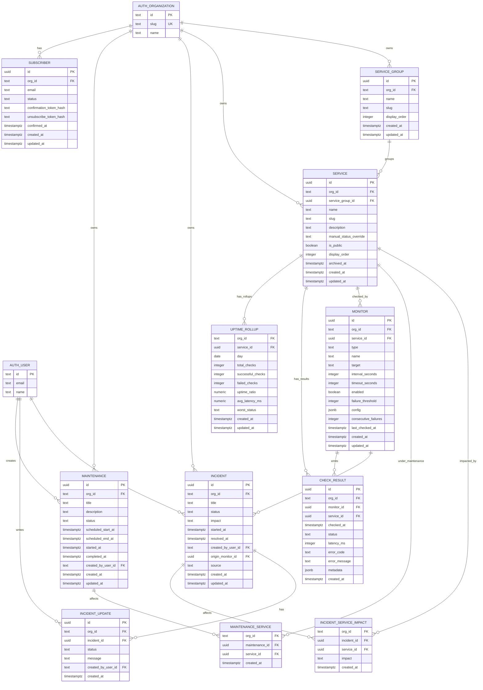
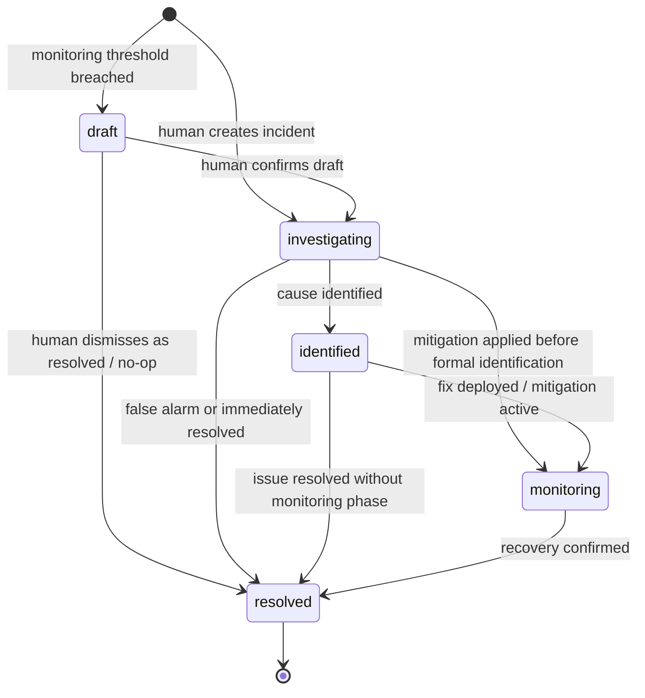
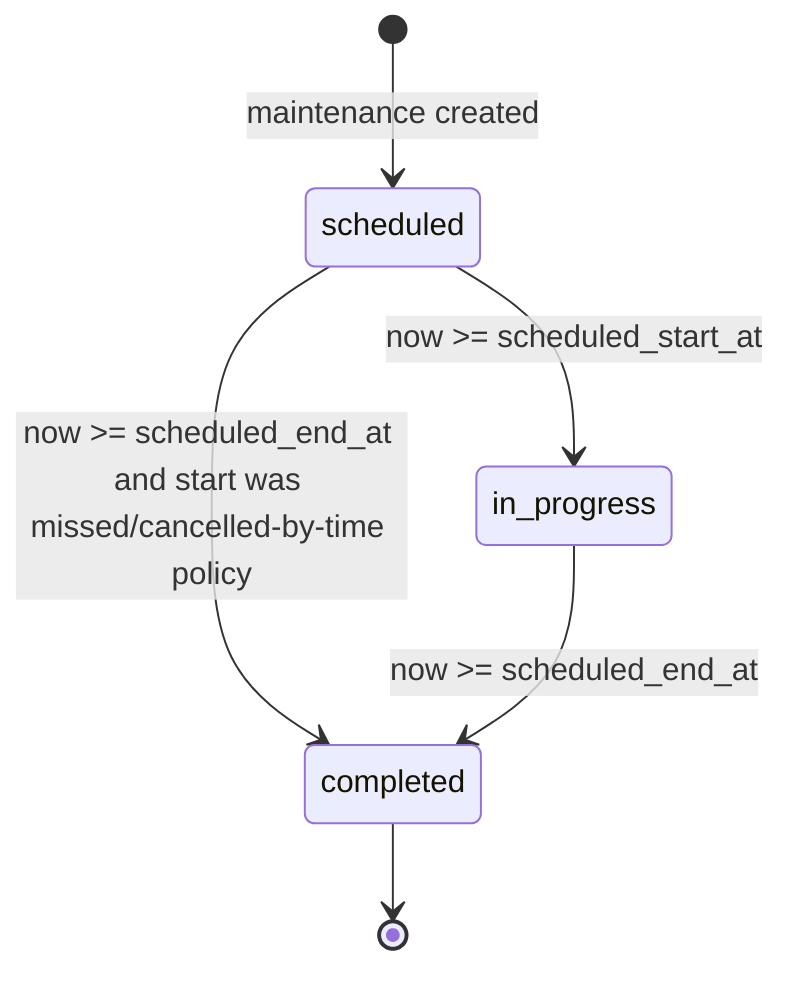

# DOMAIN.md

WatchDog domain contract: entities, relationships, tenant scoping, state machines, status resolution, monitoring persistence, retention, and canonical domain events.

Architecture, runtime topology, CQRS mechanics, and real-time fanout are owned by [ARCHITECTURE.md](./ARCHITECTURE.md). This file owns the data and behavior model.

---

## Global data rules

- Better-Auth-owned ids are `text`: `org_id`, `user_id`, and `created_by_user_id` reference Better Auth tables by text id.
- WatchDog-native primary keys stay `uuid`: `services.id`, `incidents.id`, `monitors.id`, `check_results.id`, and other WatchDog aggregate ids.
- Status-like columns are stored as `text` with `CHECK` constraints, not PostgreSQL enum types. Status ladders are product-tunable; a `CHECK` constraint evolves through a small migration instead of a type-rewrite workflow.
- Better Auth owns organization, team, membership, user, session, account, verification, invitation, and role table shapes. WatchDog documents only the references it stores.

---

## Entity catalog

Types below are logical domain/database types. DDL is illustrative, not final migration code.

### Better-Auth-owned references

Better Auth's organization plugin owns the organization, team, membership, invitation, role, and user tables. WatchDog does not define DDL for those tables in this domain contract.

WatchDog stores references to the committed Better Auth schema:

| Reference | Type | Contract |
|---|---:|---|
| `org_id` | `text` | FK target is Better Auth `organization.id` from the committed DBMate migration. |
| `user_id` | `text` | Reference to the Better Auth user table id. |
| `created_by_user_id` | `text null` | Reference to the Better Auth user table id; null for system-created records. |

Notes:

- The Better Auth schema is generated once, reviewed, committed as a DBMate migration, and then treated as the FK contract. Frozen as of `better-auth@1.7.3`: `"user"`, `"session"`, `"account"`, `"verification"`, `"organization"`, `"team"`, `"teamMember"`, `"member"`, `"invitation"`. See `ARCHITECTURE.md` section 7 for the full table.
- Identifier quoting is load-bearing when WatchDog reads these tables. `user` is a reserved word in PostgreSQL and `"teamMember"` is camelCase, and every Better Auth column is camelCase. Raw SQL that joins a WatchDog table to a Better Auth table quotes the Better Auth side and leaves the snake_case WatchDog side bare.
- `organization.id` is `text` and `organization.slug` is `text not null unique`, so `org_id` stays `text` and the `/status/:orgSlug` lookup needs no additional index.
- The public page answers only for a slug inside WatchDog's slug rule, the one services and groups already follow: lowercase letters and digits in hyphen-separated runs (`^[a-z0-9]+(?:-[a-z0-9]+)*$`), at most 120 characters. Any other slug, malformed or merely unknown, gets the same answer as one no organization has: one 404 body, whatever was asked, so a miss reveals nothing about which organizations exist, and nothing reaches SQL that the rule already excludes. Better Auth itself accepts any non-empty slug at creation, so until creation applies the same rule (Epic 3 retrospective, open question on R-8), an organization created with a slug outside it has no reachable public page.
- Better Auth tables sit outside WatchDog tenant-scoped RLS.
- WatchDog organization queries may read Better Auth tables for active-org resolution, switcher data, and public slug lookup, but WatchDog does not emit organization/team/membership domain events.

---

### Service

A customer-visible component on the status page.

| Field | Type | Constraints / Notes |
|---|---:|---|
| `id` | `uuid` | PK |
| `org_id` | `text` | FK -> Better Auth `organization.id` |
| `service_group_id` | `uuid null` | FK -> `service_groups.id` |
| `name` | `text` | Required |
| `slug` | `text` | Unique per `org_id` including archived services, so archiving reserves a slug permanently. Chosen over a partial index on `archived_at is null`: reuse is rare, and a uniqueness rule that depends on a mutable column is a sharper edge than a reserved name. Reversible with a one-line migration if it proves wrong. |
| `description` | `text null` | Optional. Customer-facing: the public page shows it with the service, so it is written for customers and is never an operator's note. Decided by the Epic 3 retrospective (2026-09-21, C-1), after story 3.3 had already published it. |
| `manual_status_override` | `text null` | CHECK: `operational`, `degraded`, `partial_outage`, `major_outage`, `maintenance`; manual override wins over computed status |
| `is_public` | `boolean` | Whether shown on public page. Also decides what the page says about incidents and windows naming the service; see Public status page. |
| `display_order` | `integer` | Public ordering |
| `last_known_status` | `text` | Not null, default `operational`; CHECK as the ladder above. Last result of `resolveServiceStatus`, written only by the recomputation handler. See Status recomputation. |
| `archived_at` | `timestamptz null` | Set when archived; null when active |
| `created_at` | `timestamptz` | Required |
| `updated_at` | `timestamptz` | Required |

FKs:

- `org_id` -> Better Auth `organization.id`
- `service_group_id` -> `service_groups.id`

Tenant scoping: carries `org_id`.

Archive semantics:

- v1 has no hard service delete.
- Archived services are excluded from public status pages and active admin lists.
- Archiving suspends the service's monitors non-destructively. The worker due-monitor query joins `services` and filters `services.archived_at IS NULL`.
- Restoring a service clears `archived_at` and automatically resumes its enabled monitors.

---

### ServiceGroup

Public grouping for services/components.

| Field | Type | Constraints / Notes |
|---|---:|---|
| `id` | `uuid` | PK |
| `org_id` | `text` | FK -> Better Auth `organization.id` |
| `name` | `text` | Required |
| `slug` | `text` | Unique per org |
| `display_order` | `integer` | Public ordering |
| `created_at` | `timestamptz` | Required |
| `updated_at` | `timestamptz` | Required |

FKs:

- `org_id` -> Better Auth `organization.id`

Tenant scoping: carries `org_id`.

---

### Incident

Lifecycle aggregate for service-impacting incidents.

| Field | Type | Constraints / Notes |
|---|---:|---|
| `id` | `uuid` | PK |
| `org_id` | `text` | FK -> Better Auth `organization.id` |
| `title` | `text` | Required |
| `status` | `text` | CHECK: `draft`, `investigating`, `identified`, `monitoring`, `resolved` |
| `impact` | `text` | CHECK: `none`, `minor`, `major`, `critical` |
| `started_at` | `timestamptz` | Required |
| `resolved_at` | `timestamptz null` | Set when resolved |
| `created_by_user_id` | `text null` | Ref -> Better Auth user; null for system-created draft |
| `origin_monitor_id` | `uuid null` | FK -> `monitors.id`; set for monitor-born draft incidents |
| `source` | `text` | CHECK: `manual`, `monitoring`, `ai_assisted` |
| `created_at` | `timestamptz` | Required |
| `updated_at` | `timestamptz` | Required |

FKs:

- `org_id` -> Better Auth `organization.id`
- `created_by_user_id` -> Better Auth user table
- `origin_monitor_id` -> `monitors.id`

Tenant scoping: carries `org_id`.

Deduplication invariant:

```sql
create unique index incidents_monitor_draft_uk
on incidents (org_id, origin_monitor_id)
where status = 'draft';
```

- The partial unique index is the authoritative guard against duplicate open draft incidents for the same monitor.
- Command handlers may keep an app-level fast path to avoid work before insert, but correctness comes from the index and unique-violation handling.
- If a confirmed monitoring incident remains unresolved, the application may additionally suppress creating another draft for the same monitor; that is a product rule layered above the draft index.

Related join table:

#### IncidentServiceImpact

| Field | Type | Constraints / Notes |
|---|---:|---|
| `org_id` | `text` | FK -> Better Auth `organization.id`; included for direct RLS enforcement |
| `incident_id` | `uuid` | FK -> `incidents.id` |
| `service_id` | `uuid` | FK -> `services.id` |
| `impact` | `text` | CHECK: `none`, `minor`, `major`, `critical`; per-service impact |
| `created_at` | `timestamptz` | Required |

Composite PK:

- (`incident_id`, `service_id`)

Tenant scoping: carries `org_id`.

---

### IncidentUpdate

Append-only update timeline for an incident.

| Field | Type | Constraints / Notes |
|---|---:|---|
| `id` | `uuid` | PK |
| `org_id` | `text` | FK -> Better Auth `organization.id` |
| `incident_id` | `uuid` | FK -> `incidents.id` |
| `status` | `text` | CHECK: `draft`, `investigating`, `identified`, `monitoring`, `resolved`; status after this update |
| `message` | `text` | Public/admin update body |
| `created_by_user_id` | `text null` | Ref -> Better Auth user; null for system-generated |
| `created_at` | `timestamptz` | Required; append-only ordering. Defaults to `clock_timestamp()`, the time the entry is written, not the transaction's start, so order follows the incident's row lock |

Who writes an entry, and what announces it:

- Declaring an incident and every transition append one, in the same transaction as the status they record, so the timeline cannot disagree with the incident. The operator may supply the message; otherwise a default worded for customers is written, and a blank message counts as none. `created_by_user_id` is whoever made the move.
- `PostIncidentUpdateCommand` appends one at the incident's current status.
- A `draft` may take posted updates, and an operator triaging one in place is the reason; from Epic 5 a monitor writes into a draft too. An entry recorded at status `draft` is an operator's note, not a customer update: the public page leaves the incident's draft era off its timeline, so confirming a draft publishes nothing written before it (Epic 3 retrospective, R-4). Decided 2026-09-23, closing Epic 2's D-4.
- A public lifecycle transition announces the entry it appended as `incident.update_posted`, carrying that entry's id. `incident.state_changed` is admin-only, so without this a move to `identified` or `monitoring` would reach no public subscriber at all.
- A move out of `draft` is not a public lifecycle transition, because a draft was never shown to customers. Confirming announces `incident.confirmed`, dismissing announces `incident.dismissed`, and neither emits `incident.update_posted`. The declaration is announced by `incident.created`, which is draft-gated.
- Commit `87259e6` briefly said the opposite, that only a posted update announces. It traded a double notification for no public notification at all, and contradicted the invariant below. Withdrawn by the Epic 2 retrospective, R-5.

FKs:

- `org_id` -> Better Auth `organization.id`
- `incident_id` -> `incidents.id`
- `created_by_user_id` -> Better Auth user table

Tenant scoping: carries `org_id`.

Invariants:

- Updates are append-only.
- Incident current status is updated by the command handler in the same transaction that appends the update.
- Every public lifecycle transition appends an update and emits `incident.update_posted`; `incident.state_changed` remains admin-only.

---

### Maintenance

Scheduled maintenance window affecting one or more services.

| Field | Type | Constraints / Notes |
|---|---:|---|
| `id` | `uuid` | PK |
| `org_id` | `text` | FK -> Better Auth `organization.id` |
| `title` | `text` | Required |
| `description` | `text null` | Optional. Customer-facing on the same terms as a service's: the public page shows it with the window. |
| `status` | `text` | CHECK: `scheduled`, `in_progress`, `completed` |
| `scheduled_start_at` | `timestamptz` | Required |
| `scheduled_end_at` | `timestamptz` | Required |
| `started_at` | `timestamptz null` | Set when started |
| `completed_at` | `timestamptz null` | Set when completed |
| `created_by_user_id` | `text null` | Ref -> Better Auth user |
| `created_at` | `timestamptz` | Required |
| `updated_at` | `timestamptz` | Required |

FKs:

- `org_id` -> Better Auth `organization.id`
- `created_by_user_id` -> Better Auth user table

Tenant scoping: carries `org_id`.

Related join table:

#### MaintenanceService

| Field | Type | Constraints / Notes |
|---|---:|---|
| `org_id` | `text` | FK -> Better Auth `organization.id`; included for direct RLS enforcement |
| `maintenance_id` | `uuid` | FK -> `maintenance.id` |
| `service_id` | `uuid` | FK -> `services.id` |
| `created_at` | `timestamptz` | Required |

Composite PK:

- (`maintenance_id`, `service_id`)

Tenant scoping: carries `org_id`.

---

### Monitor

Synthetic check configuration.

| Field | Type | Constraints / Notes |
|---|---:|---|
| `id` | `uuid` | PK |
| `org_id` | `text` | FK -> Better Auth `organization.id` |
| `service_id` | `uuid` | FK -> `services.id` |
| `type` | `text` | CHECK: `http`, `tcp`, `keyword`, `ssl_expiry` |
| `name` | `text` | Required |
| `target` | `text` | URL, host:port, hostname, etc. |
| `interval_seconds` | `integer` | Required |
| `timeout_seconds` | `integer` | Required |
| `enabled` | `boolean` | Required |
| `failure_threshold` | `integer` | Consecutive failures before draft incident |
| `config` | `jsonb` | Type-specific config |
| `consecutive_failures` | `integer` | Cached counter maintained by worker |
| `last_checked_at` | `timestamptz null` | Worker-maintained |
| `created_at` | `timestamptz` | Required |
| `updated_at` | `timestamptz` | Required |

FKs:

- `org_id` -> Better Auth `organization.id`
- `service_id` -> `services.id`

Tenant scoping: carries `org_id`.

---

### CheckResult

Append-only monitor execution result.

| Field | Type | Constraints / Notes |
|---|---:|---|
| `id` | `uuid` | PK with partition key |
| `org_id` | `text` | FK -> Better Auth `organization.id` |
| `monitor_id` | `uuid` | FK -> `monitors.id` |
| `service_id` | `uuid` | FK -> `services.id` |
| `checked_at` | `timestamptz` | Partition key |
| `status` | `text` | CHECK: `success`, `failure` |
| `latency_ms` | `integer null` | Null when unavailable |
| `error_code` | `text null` | Transport/protocol error |
| `error_message` | `text null` | Truncated diagnostic message |
| `metadata` | `jsonb` | Type-specific result payload |
| `created_at` | `timestamptz` | Required |

FKs:

- `org_id` -> Better Auth `organization.id`
- `monitor_id` -> `monitors.id`
- `service_id` -> `services.id`

Tenant scoping: carries `org_id`.

Persistence:

- Append-only.
- Partitioned by `checked_at`.
- Raw rows serve recent forensics and are retained for the configured raw retention window.

---

### UptimeRollup

Daily rollup powering 90-day uptime bars.

| Field | Type | Constraints / Notes |
|---|---:|---|
| `org_id` | `text` | FK -> Better Auth `organization.id` |
| `service_id` | `uuid` | FK -> `services.id` |
| `day` | `date` | Rollup date |
| `total_checks` | `integer` | Count of checks |
| `successful_checks` | `integer` | Count of successful checks |
| `failed_checks` | `integer` | Count of failed checks |
| `uptime_ratio` | `numeric(6,5)` | `successful_checks / total_checks` |
| `avg_latency_ms` | `numeric null` | Average successful latency |
| `worst_status` | `text` | CHECK: `operational`, `degraded`, `major_outage`; monitor-observed scale only |
| `created_at` | `timestamptz` | Required |
| `updated_at` | `timestamptz` | Required |

Composite PK:

- (`org_id`, `service_id`, `day`)

FKs:

- `org_id` -> Better Auth `organization.id`
- `service_id` -> `services.id`

Tenant scoping: carries `org_id`.

Implementation:

- Preferred v1: rollup table refreshed by worker for deterministic updates and easy public query shape.
- Rollups use a deliberate 3-level monitor-observed scale: `operational`, `degraded`, `major_outage`.
- `worst_status` is computed solely from `check_results`. It is intentionally distinct from incident-declared effective service status and must not fold incidents or maintenance into the rollup.
- A day with no checks produces no row at all: the upsert aggregates `check_results` grouped by day. The public page says so explicitly rather than omitting the day; see Public status page.

---

### Subscriber

Public email subscriber for an organization's status updates.

| Field | Type | Constraints / Notes |
|---|---:|---|
| `id` | `uuid` | PK |
| `org_id` | `text` | FK -> Better Auth `organization.id` |
| `email` | `text` | Required; normalized with trim + lowercase at write time |
| `status` | `text` | CHECK: `pending`, `confirmed`, `unsubscribed` |
| `confirmation_token_hash` | `text null` | For email confirmation flow |
| `unsubscribe_token_hash` | `text` | For unsubscribe flow |
| `confirmed_at` | `timestamptz null` | Set after confirmation |
| `created_at` | `timestamptz` | Required |
| `updated_at` | `timestamptz` | Required |

FKs:

- `org_id` -> Better Auth `organization.id`

Tenant scoping: carries `org_id`.

Email uniqueness:

```sql
create unique index subscribers_org_email_uk
on subscribers (org_id, lower(email));
```

The same email address may subscribe to different organizations. The functional index enforces tenant-scoped uniqueness; write-time normalization keeps stored data clean so raw casing does not drift into notification sends.

---

## ERD



Better Auth team and membership relationships are intentionally omitted from the WatchDog ERD because their table shapes are owned by the Better Auth organization plugin.

---

## Multi-tenant data model and RLS

### Scope model

WatchDog uses a shared database with tenant scoping by Better Auth organization id.

Tenant-scoped WatchDog tables:

- `service_groups`
- `services`
- `incidents`
- `incident_updates`
- `incident_service_impacts`
- `maintenance`
- `maintenance_services`
- `monitors`
- `check_results`
- `uptime_rollups`
- `subscribers`

Better-Auth-owned tables:

- user, session, account, verification
- organization, team, membership, invitation, role

Better Auth tables sit outside WatchDog tenant-scoped RLS policies. DBMate remains the only migration source of truth.

### `app.current_org_id` GUC contract

Every command/query repository operation runs inside a transaction that sets the active organization:

```sql
begin;

set local app.current_org_id = '<resolved-better-auth-org-id>';

-- repository SQL here

commit;
```

Contract:

1. CQRS middleware resolves session -> user -> active organization -> role.
2. It validates the resolved org id against the Better Auth id format and rejects malformed ids with a 4xx response.
3. It injects `org_id`, `user_id`, and role into command/query context.
4. Repository adapters open a transaction.
5. Repository adapters set `SET LOCAL app.current_org_id`.
6. Tenant-scoped SQL executes under RLS.
7. The GUC is transaction-local and disappears after commit/rollback.

### Tenant-scoped RLS policy sketch

Illustrative policy for tables that directly carry `org_id`:

```sql
alter table services enable row level security;
alter table services force row level security;

create policy services_org_isolation
on services
using (
  org_id = current_setting('app.current_org_id', true)
)
with check (
  org_id = current_setting('app.current_org_id', true)
);
```

Apply the same pattern to all tenant-scoped WatchDog tables that carry `org_id`.


### Tenant-scoped foreign keys

Row level security does not protect foreign keys. PostgreSQL performs referential integrity checks with row security disabled, so a tenant can reference a row it cannot read. Verified directly: as `watchdog_app` scoped to organization A, selecting another organization's `service_groups` row returned nothing while inserting a `services` row referencing that same id succeeded.

RLS protects reads and writes *of* a row. It says nothing about what a row may point *at*.

**Every foreign key between two tenant-scoped tables includes `org_id` in the key.** The referenced table carries a unique constraint on `(id, org_id)`, and the referencing table's foreign key spans `(<ref>_id, org_id)`. The database then refuses a cross-tenant reference itself, rather than relying on an application check that a single missing validation would defeat.

```sql
alter table service_groups
  add constraint service_groups_id_org_uk unique (id, org_id);

alter table services
  add constraint services_service_group_id_fkey
  foreign key (service_group_id, org_id)
  references service_groups (id, org_id)
  on delete set null (service_group_id);
```

Two details make it work. `MATCH SIMPLE`, the default, leaves the constraint unenforced when any column is null, so a nullable reference such as an ungrouped service stays legal. And `on delete set null (service_group_id)` names the column to clear, because `org_id` is `NOT NULL` and a plain `SET NULL` would try to clear it too.

This applies to every such relationship in this document — `incident_service_impacts` to `incidents` and `services`, `maintenance_services` to `maintenance` and `services`, `incidents.origin_monitor_id` to `monitors`, `check_results` and `uptime_rollups` to their monitors. `src/shared/db/tenant-rls-coverage.integration.test.ts` fails on any foreign key between two `org_id` tables that omits it.

### Join table policy sketch

Join tables include `org_id` to avoid relying on join-based RLS for simple mutations.

```sql
alter table incident_service_impacts enable row level security;
alter table incident_service_impacts force row level security;

create policy incident_service_impacts_org_isolation
on incident_service_impacts
using (
  org_id = current_setting('app.current_org_id', true)
)
with check (
  org_id = current_setting('app.current_org_id', true)
);
```

---

## Incident state machine

Incident lifecycle states:

- `draft`
- `investigating`
- `identified`
- `monitoring`
- `resolved`

The prompt-defined public lifecycle is:

```text
investigating -> identified -> monitoring -> resolved
```

`draft` exists for human-in-the-loop auto-incidents created by monitoring.

All three Better Auth v1 organization roles, `owner`, `admin`, and `member`, can perform v1 write actions. Finer editor/viewer permissions are roadmap.



### Allowed transitions

| From | To | Trigger | Actor |
|---|---|---|---|
| `[none]` | `draft` | Consecutive monitor failures reach threshold | Worker |
| `[none]` | `investigating` | Manual incident creation | Allowed v1 role |
| `draft` | `investigating` | Human confirms monitor-generated draft | Allowed v1 role |
| `draft` | `resolved` | Human dismisses or closes draft | Allowed v1 role |
| `investigating` | `identified` | Cause known and update posted | Allowed v1 role |
| `investigating` | `monitoring` | Mitigation deployed before formal cause statement | Allowed v1 role |
| `investigating` | `resolved` | Incident resolved or false alarm | Allowed v1 role |
| `identified` | `monitoring` | Fix/mitigation deployed and being watched | Allowed v1 role |
| `identified` | `resolved` | Resolved without separate monitoring period | Allowed v1 role |
| `monitoring` | `resolved` | Recovery confirmed | Allowed v1 role or worker-assisted suggestion requiring human confirmation |

Invariants:

- `resolved_at` is set exactly once when transitioning to `resolved`.
- Transitions of one incident are serialized. The handler reads the incident under a row lock, so concurrent requests are judged one after another against the committed status, and `resolved` stays terminal under concurrency. A posted update reads under a share lock, so it records the committed status.
- Every transition appends an `incident_updates` row in the same transaction, the declaration (`[none] -> investigating`) included. See IncidentUpdate for who writes entries and which event announces them.
- Dismissing a draft is a terminal draft-cleanup path: `TransitionIncidentCommand` from `draft` to `resolved` sets `resolved_at` as needed but emits `incident.dismissed` only, never `incident.resolved`. (ARCHITECTURE names a separate `DismissDraftIncidentCommand`; as built, one transition command serves every move. See the Epic 2 retrospective, AV-7.)
- Confirming a draft (`draft -> investigating`) emits `incident.confirmed` as well as `incident.state_changed`. It is the public announcement that a monitor-born incident is real, and one of the status recomputation triggers.
- Public notifications are emitted after the transaction commits.
- AI may draft text or suggest impact/affected services, but does not publish customer-facing updates autonomously.

---

## Maintenance state machine

Maintenance lifecycle states:

- `scheduled`
- `in_progress`
- `completed`

The worker drives time-based transitions.



### Allowed transitions

| From | To | Trigger | Actor |
|---|---|---|---|
| `[none]` | `scheduled` | Maintenance window created | Allowed v1 role |
| `scheduled` | `in_progress` | Current time reaches `scheduled_start_at` | Worker |
| `scheduled` | `completed` | Current time passes `scheduled_end_at` before start transition runs | Worker |
| `in_progress` | `completed` | Current time reaches `scheduled_end_at` | Worker |
| `scheduled` | `completed` | Human manually completes/cancels as completed | Allowed v1 role |
| `in_progress` | `completed` | Human manually completes early | Allowed v1 role |

Invariants:

- During `in_progress`, affected services resolve to `maintenance` unless a manual service override supersedes computed state.
- Editing scope. A `scheduled` window may be edited freely. A window `in_progress` accepts only a new `scheduled_end_at` and a change of affected services, the two corrections an operator needs mid-window; its title, description and start describe a window that has already begun. A `completed` window is immutable.
- Deleting is for work that never happened, so only a `scheduled` window may be deleted. A window that started or finished is completed instead, and its record survives. Both refusals are conflicts, not malformed requests.
- A window that goes straight from `scheduled` to `completed` keeps `started_at` null. Neither path may record a start that never happened.
- Worker transition commands must be idempotent.
- Worker commands emit maintenance lifecycle events only when an actual state change occurs.

---

## Status model

### Service status values

```ts
type ServiceStatus =
  | 'operational'
  | 'degraded'
  | 'partial_outage'
  | 'major_outage'
  | 'maintenance';
```

Ordering for worst-of comparison:

```ts
const SERVICE_STATUS_RANK: Record<ServiceStatus, number> = {
  operational: 0,
  maintenance: 1,
  degraded: 2,
  partial_outage: 3,
  major_outage: 4,
};
```

`maintenance` is visible and non-operational, but incident outage states outrank it when computing worst impact.

Two consequences of this being a worst-of reduction rather than a cascade, stated because story work misread it once already:

- Several active incidents naming one service reduce to the worst impact among them. `activeIncidentImpacts` is a list and is reduced, never sampled.
- An in-progress maintenance window is always considered, not only when no incident is active. A `major` incident during planned maintenance resolves to `partial_outage`: `statusFromIncidentImpact` maps `major` to `partial_outage`, which ranks 3 against maintenance's 1. Only a `critical` incident yields `major_outage`. (An earlier revision of this note said `major_outage`; the mapping above was always authoritative.)

### Incident impact values

```ts
type IncidentImpact =
  | 'none'
  | 'minor'
  | 'major'
  | 'critical';
```

Impact to service status mapping:

```ts
function statusFromIncidentImpact(impact: IncidentImpact): ServiceStatus {
  switch (impact) {
    case 'none':
      return 'operational';
    case 'minor':
      return 'degraded';
    case 'major':
      return 'partial_outage';
    case 'critical':
      return 'major_outage';
  }
}
```

### Monitor-derived status

```ts
type MonitorDerivedState =
  | 'healthy'
  | 'degraded'
  | 'failing';

function statusFromMonitorState(state: MonitorDerivedState): ServiceStatus {
  switch (state) {
    case 'healthy':
      return 'operational';
    case 'degraded':
      return 'degraded';
    case 'failing':
      return 'major_outage';
  }
}
```

The `failing -> major_outage` monitor-derived mapping and the monitor-born draft default `impact: 'critical'` are both tunable product mappings. The draft is created only after N consecutive failures, never after a single failed check unless the monitor's threshold is configured to `1`.

### Status-resolution precedence function

Manual override wins. Otherwise compute worst-of active incident impact, active maintenance, and monitor-derived state.

```ts
type ResolveServiceStatusInput = {
  manualOverride: ServiceStatus | null;
  activeIncidentImpacts: IncidentImpact[];
  hasActiveMaintenance: boolean;
  monitorState: MonitorDerivedState;
};

function resolveServiceStatus(input: ResolveServiceStatusInput): ServiceStatus {
  if (input.manualOverride !== null) {
    return input.manualOverride;
  }

  const incidentStatuses = input.activeIncidentImpacts.map(statusFromIncidentImpact);

  const maintenanceStatus: ServiceStatus[] = input.hasActiveMaintenance
    ? ['maintenance']
    : [];

  const monitorStatus = statusFromMonitorState(input.monitorState);

  return worstOf([
    ...incidentStatuses,
    ...maintenanceStatus,
    monitorStatus,
  ]);
}

function worstOf(statuses: ServiceStatus[]): ServiceStatus {
  return statuses.reduce<ServiceStatus>((worst, current) => {
    return SERVICE_STATUS_RANK[current] > SERVICE_STATUS_RANK[worst]
      ? current
      : worst;
  }, 'operational');
}
```


### Status recomputation and `service.status_changed`

`resolveServiceStatus` above is a pure function over live inputs. Emitting `service.status_changed` requires comparing a new result against a previous one, and a pure function has no previous one to compare against. The mechanism is therefore recorded here rather than left to the implementer.

**The shape is forced, not chosen.** Effective status reads four inputs owned by three modules: the manual override and monitor-derived state reach the `service` module, active incident impact belongs to `incident`, and active maintenance to `maintenance`. Modules do not import each other, so `incident` cannot compute a service's status. Recomputation is therefore event-driven and lives in the `service` module, which `ARCHITECTURE.md` section 2 already names as the owner of status recomputation orchestration.

**Services carry their last resolved status.**

| Field | Type | Constraints / Notes |
|---|---:|---|
| `last_known_status` | `text` | Not null, default `operational`. CHECK: `operational`, `degraded`, `partial_outage`, `major_outage`, `maintenance`. The most recent result of `resolveServiceStatus`, written only by the recomputation handler. |

This is a derived value held for two reasons: it is the only way to diff, and it lets the public read model return status without recomputing across incidents, maintenance windows and monitor results on every request.

**Recomputation is triggered by events, never by a direct call across a module boundary.** The `service` module subscribes to every event that can move a service's status:

- `incident.created`, `incident.confirmed`, `incident.state_changed`, `incident.resolved`, `incident.dismissed`, `incident.updated`
- `maintenance.started`, `maintenance.completed`, `maintenance.deleted`, `maintenance.updated`
- `service.manual_override_set`, `service.manual_override_cleared`, `service.restored`
- `monitor.check_succeeded`, `monitor.check_failed`, `monitor.recovered`, `monitor.threshold_breached`

`incident.updated` and `maintenance.updated` are on the list because an edit can rewrite an active incident's affected services and their impacts, or an in-progress window's affected services. `service.restored` is there because archived services are skipped, so a restored service returns holding whatever it held when it was archived. An earlier revision of this list omitted all three; Story 2.17 found each to be a way for status to move without an announcement.

**The inputs, precisely.** Active incident impact is the per-service impact (`incident_service_impacts.impact`, not the incident's headline impact) on incidents in `investigating`, `identified` or `monitoring`. A `draft` is excluded: it is unconfirmed and was never shown to customers. Active maintenance is membership of a window in `in_progress`.

**Every live service in the organization is recomputed, not only those the event names.** By the time the handler runs, the link rows that would say which services were affected may be gone: an edit can drop a service from an incident, and deleting a window cascades its links away. A status page holds tens of services, so recomputing all of them is one cheap read, and the diff keeps it silent for services whose answer did not move.

Where the result differs from `last_known_status`, the handler writes the new value and emits `service.status_changed`, after the transaction commits. Where it does not differ, nothing is written and nothing is emitted; the handler is idempotent and safe to run repeatedly.

**Status settles just after the command that moved it, not atomically with it.** The command commits and returns; the event it emitted then drives a recomputation the command does not await. A read issued the instant a status-moving command returns can therefore still see the previous value, for as long as the handler takes: milliseconds, in-process. Nothing needs invalidating, since every read consults `last_known_status` directly. A client that must observe the change as it lands listens for `service.status_changed` (Epic 4) rather than re-reading.

**Recomputations of one organization are serialized.** The handler locks the organization's live services (`for no key update`) before reading any input. Without the lock, two concurrent recomputations can both see the old value and both announce the change, or a slower one can overwrite a newer answer with a stale one. `for no key update` rather than `for update`, so an insert whose foreign-key check takes `for key share` on a service, such as naming it on an incident, does not wait behind a recomputation.

Each recomputation runs under the tenant context of the organization named in the triggering event, so one worker pass across several organizations recomputes each under its own.

Archived services are skipped. They appear on no public or active list, so announcing their status changes would fan out events nobody can act on.

**What `last_known_status` cannot say is when it changed.** The handler writes the value and deliberately leaves `updated_at` alone, so it still records human edits, and no column records the moment a status moved. A page can therefore say a service is degraded, and say since when only for a service an incident or a window explains, from that incident's or window's own timestamps. "Degraded since 14:02" for a service degraded by a manual override, or from Epic 5 by monitor state, is not representable. Out of scope for v1, and the cheapest fix when it is wanted is a `status_changed_at` column written by this handler when, and only when, the value moves. Recorded here because the story 3.1 wireframe, which called itself throwaway, was the only place that said so (Epic 3 retrospective, AV-7).

**The risk is a derived column drifting from its inputs**, and there are two ways it can. A future write path could move an input without emitting one of the events above; the event catalog is the guard for that, since a command that changes status without emitting is already a defect by the definition of done. The other way is a recomputation that simply fails: the events are one-shot and nothing re-emits them, so a transient database error, or a process that died mid-flight, leaves `last_known_status` wrong until some unrelated change in that organization.

**The worker therefore reconciles.** Every pass recomputes each organization after its other work, which is the same recomputation the events trigger: idempotent, and silent when nothing moved, so a healthy system pays one cheap read per organization per pass and announces nothing. Drift that it does correct is logged, because a correction means an event was lost and that is worth knowing about. This was deferred to post-v1 until the Epic 2 retrospective found the failure path (R-7).

### Public status page

What `/status/:orgSlug` shows, and the one status it leads with. Decided 2026-09-21 by the Epic 3 retrospective (R-1, R-2, R-12). Until then the banner rule lived only in the story 3.1 wireframe, and the page published what the rule below now withholds.

**A service is visible** when it is `is_public` and not archived. Only visible services are listed.

**Incidents and windows are judged by the services they name.** The page considers active incidents (`investigating`, `identified`, `monitoring`) and open windows (`scheduled`, `in_progress`), and for each one:

| It names | The page |
|---|---|
| no service | lists it, with no affected services. Blast radius is often unknown when an incident is declared, and an operator who has not named services yet still means customers to see it. |
| at least one visible service | lists it, with only the visible services as affected. |
| only services that are not visible | leaves it off. It describes components the organization chose not to publish. |

An affected-service reference that is not visible is never published, even as an opaque id: it announces a component the organization withheld, and it names nothing a renderer has in its service list.

Visibility is judged from current rows at read time. Making a service private, or archiving it, takes the incidents and windows that named only it off the page with it; nothing about them is stored.

**An incident's timeline leaves out its draft era.** The page shows a listed incident's entries oldest first, except those recorded with status `draft`. A draft was never shown to customers, and neither were the notes taken while it was one. A posted update records the incident's current status, and nothing stops an update being posted to a draft (Epic 2's D-4 is the open question of whether anything should), so before this rule, confirming a draft published every triage note written on it (Epic 3 retrospective, R-4). A confirmed draft's timeline therefore opens at its confirmation, the `draft -> investigating` entry.

**The banner.** `overallStatus` is `worstOf` over two lists:

- every visible service's `last_known_status`;
- every *listed* incident's headline impact (`incidents.impact`), through `statusFromIncidentImpact`.

The second list is why a listed `critical` incident can never sit under an `operational` banner, whether it names no service, names services that are private, or names public ones whose own status has not caught up. The headline impact is the one the page prints beside the incident, so the banner agrees with what a reader sees. An incident the rule leaves off contributes nothing, so a private incident cannot raise the banner by the back door. A window reaches the banner only through the services it puts in `maintenance`.

**Uptime is shaped now and filled in Epic 5.** `uptime.windowDays` is 90. `uptime.services` is empty until rollups exist, which is how an integrator tells "no data yet" from "100% uptime". Once they exist, each service carries one entry per day in the window, oldest first, so a renderer draws its bars without date arithmetic. A day the rollups have no row for carries `uptimeRatio: null` and `worstStatus: null`: no checks ran that day, because the monitor did not exist yet or the worker was down, and that is a gap rather than an outage. `worstStatus` is the rollup's `worst_status`, the three-level monitor scale (`operational`, `degraded`, `major_outage`) computed from `check_results` alone, and it is what colours a day's bar. The payload carried no such field until the Epic 3 retrospective added it (R-17), while the contract still had no integrator to break.

This rule is written for the page; it is not yet applied everywhere these items are referenced publicly. The public event gate sketched in `ARCHITECTURE.md` section 5.4 checks only the draft status, so an event about an incident this rule leaves off would pass it. Epic 4 builds that gate and must apply this rule there too.

---

## Monitoring data

### `check_results` partitioning strategy

`check_results` is append-only and partitioned by time using `checked_at`.

Recommended v1 partitioning:

- Range partition by month.
- Keep indexes local to partitions.
- Query 90-day public uptime through rollups, not raw check rows.
- Raw `check_results` retention defaults to 30 days via `CHECK_RESULTS_RETENTION_DAYS=30`.
- The worker's partition-maintenance job detaches and drops partitions older than the configured raw retention window. This is a metadata operation; it must not perform row-level deletes for raw rows.
- `uptime_rollups` retention defaults to 400 days via `ROLLUP_RETENTION_DAYS=400`. Rollup rows older than the configured value are pruned.
- The differing lifetimes are intentional: raw rows serve recent forensics; public 90-day bars read rollups only, and retaining at least 400 days keeps room for a trailing-year public view later without a data-gap migration.

Illustrative DDL:

```sql
create table check_results (
  id uuid not null,
  org_id text not null,
  monitor_id uuid not null references monitors(id),
  service_id uuid not null references services(id),
  checked_at timestamptz not null,
  status text not null check (status in ('success', 'failure')),
  latency_ms integer null,
  error_code text null,
  error_message text null,
  metadata jsonb not null default '{}'::jsonb,
  created_at timestamptz not null default now(),

  primary key (id, checked_at)
) partition by range (checked_at);
```

`org_id` references the committed Better Auth `organization.id` text column; the exact table name is pinned by the committed Better Auth DBMate migration.

Example monthly partition:

```sql
create table check_results_2026_06
partition of check_results
for values from ('2026-06-01') to ('2026-07-01');
```

Suggested indexes:

```sql
create index check_results_org_service_checked_at_idx
on check_results (org_id, service_id, checked_at desc);

create index check_results_org_monitor_checked_at_idx
on check_results (org_id, monitor_id, checked_at desc);

create index check_results_failure_idx
on check_results (org_id, monitor_id, checked_at desc)
where status = 'failure';
```

### Daily rollup definition

Preferred v1 implementation: `uptime_rollups` table refreshed by worker.

Reasons:

- Deterministic writes.
- Easy 90-day public page query.
- No separate TSDB.
- Avoids repeatedly scanning partitions for public reads.

Illustrative table:

```sql
create table uptime_rollups (
  org_id text not null,
  service_id uuid not null references services(id),
  day date not null,
  total_checks integer not null,
  successful_checks integer not null,
  failed_checks integer not null,
  uptime_ratio numeric(6,5) not null,
  avg_latency_ms numeric null,
  worst_status text not null check (worst_status in ('operational', 'degraded', 'major_outage')),
  created_at timestamptz not null default now(),
  updated_at timestamptz not null default now(),

  primary key (org_id, service_id, day)
);
```

`org_id` references the committed Better Auth `organization.id` text column.

Rollup upsert sketch:

```sql
insert into uptime_rollups (
  org_id,
  service_id,
  day,
  total_checks,
  successful_checks,
  failed_checks,
  uptime_ratio,
  avg_latency_ms,
  worst_status,
  updated_at
)
select
  cr.org_id,
  cr.service_id,
  date_trunc('day', cr.checked_at)::date as day,
  count(*)::integer as total_checks,
  count(*) filter (where cr.status = 'success')::integer as successful_checks,
  count(*) filter (where cr.status = 'failure')::integer as failed_checks,
  (
    count(*) filter (where cr.status = 'success')::numeric
    / nullif(count(*)::numeric, 0)
  ) as uptime_ratio,
  avg(cr.latency_ms) filter (where cr.status = 'success') as avg_latency_ms,
  case
    when count(*) filter (where cr.status = 'failure') = 0 then 'operational'
    when count(*) filter (where cr.status = 'failure') < count(*) then 'degraded'
    else 'major_outage'
  end as worst_status,
  now() as updated_at
from check_results cr
where cr.checked_at >= $1
  and cr.checked_at < $2
group by cr.org_id, cr.service_id, date_trunc('day', cr.checked_at)::date
on conflict (org_id, service_id, day)
do update set
  total_checks = excluded.total_checks,
  successful_checks = excluded.successful_checks,
  failed_checks = excluded.failed_checks,
  uptime_ratio = excluded.uptime_ratio,
  avg_latency_ms = excluded.avg_latency_ms,
  worst_status = excluded.worst_status,
  updated_at = now();
```

90-day query sketch:

```sql
select
  service_id,
  day,
  uptime_ratio,
  worst_status
from uptime_rollups
where org_id = current_setting('app.current_org_id', true)
  and day >= current_date - interval '89 days'
order by service_id, day;
```

### Consecutive-failure to draft-incident rule

Monitor execution flow:

1. Worker selects due enabled monitors by joining `monitors` to active services and filtering `services.archived_at IS NULL`.
2. Worker executes the synthetic check.
3. Worker appends a `check_results` row.
4. Worker updates `monitors.consecutive_failures`:
   - success -> reset to `0`
   - failure -> increment by `1`
5. If `consecutive_failures >= failure_threshold`, worker emits `monitor.threshold_breached`.
6. Threshold breach creates a draft incident, not a published incident.
7. Human confirms, edits, or dismisses the draft.

Pseudocode:

```ts
async function recordCheckResult(result: CheckResult): Promise<void> {
  await tx(async repo => {
    await repo.checkResults.append(result);

    const monitor = await repo.monitors.getForUpdate(result.monitorId);

    const nextConsecutiveFailures =
      result.status === 'success'
        ? 0
        : monitor.consecutiveFailures + 1;

    await repo.monitors.updateConsecutiveFailures(
      monitor.id,
      nextConsecutiveFailures,
      result.checkedAt,
    );

    if (
      result.status === 'failure' &&
      nextConsecutiveFailures >= monitor.failureThreshold
    ) {
      await repo.incidents.createDraftFromMonitor({
        orgId: monitor.orgId,
        serviceId: monitor.serviceId,
        originMonitorId: monitor.id,
        title: `Monitor failure: ${monitor.name}`,
        impact: 'critical',
        source: 'monitoring',
      });

      await repo.events.append('monitor.threshold_breached', {
        orgId: monitor.orgId,
        monitorId: monitor.id,
        serviceId: monitor.serviceId,
        consecutiveFailures: nextConsecutiveFailures,
      });
    }
  });
}
```

`findOpenMonitoringDraft` is optional as an app-level fast path. It is redundant for correctness because the partial unique index on `(org_id, origin_monitor_id) where status = 'draft'` is the authoritative duplicate-draft guard; command handlers should handle the unique-violation path idempotently.

---

## Canonical event catalog

This is the authoritative event-name catalog. Other docs reference these names only.

Events are emitted on the in-process event bus inside the process that performs the command. Events that need cross-process fanout or client real-time delivery are bridged to Postgres `LISTEN/NOTIFY` on `watchdog_events`.

Payloads are illustrative and versionable. Visibility is authoritative for public SSE gating.

### Service events

| Event name | Emitted when | Bridge to LISTEN/NOTIFY | Visibility |
|---|---|---:|---|
| `service.status_changed` | Effective status changes | Yes | Public |
| `service.created` | Service is created | Yes | Public |
| `service.updated` | Service metadata changes | Yes | Public |
| `service.archived` | Service is archived | Yes | Public |
| `service.restored` | Service is restored | Yes | Public |
| `service.manual_override_set` | Manual status override is set | Yes | Admin-only |
| `service.manual_override_cleared` | Manual status override is cleared | Yes | Admin-only |
| `service_group.created` | Service group is created | Yes | Public |
| `service_group.updated` | Service group changes | Yes | Public |
| `service_group.deleted` | Service group is removed | Yes | Public |

### Incident events

| Event name | Emitted when | Bridge to LISTEN/NOTIFY | Visibility |
|---|---|---:|---|
| `incident.created` | Human-created incident is created directly | Yes | Public, draft-gated |
| `incident.draft_created` | Monitoring creates a draft incident | Yes | Admin-only |
| `incident.confirmed` | Draft incident is confirmed | Yes | Public |
| `incident.updated` | Incident title, impact, affected services, or metadata changes | Yes | Public, draft-gated |
| `incident.update_posted` | Append-only incident update is created | Yes | Public, draft-gated |
| `incident.state_changed` | Incident lifecycle state changes | Yes | Admin-only |
| `incident.resolved` | Incident reaches `resolved` | Yes | Public |
| `incident.dismissed` | Draft incident is dismissed | Yes | Admin-only |

`incident.created` is public only when the incident-status check finds `status != 'draft'`. That admits direct human-created incidents immediately and suppresses monitor-born drafts. The same gate covers `incident.updated` and `incident.update_posted`, which is what keeps an edit to a draft, or a note posted to one, from reaching a public subscriber: an action taken while an incident is a draft announces itself to admin surfaces only. Decided 2026-09-23 with the rule above, closing Epic 2's D-4.

An `*.updated` event announces a change, not an attempt. `UpdateIncidentCommand` and `UpdateMaintenanceCommand` compare the row as it was against the row as it is, and the cover it had against the cover it has, and emit nothing when they match: a no-op edit would otherwise trigger a status recomputation and wake every public subscriber. Neither command serializes that read against a concurrent edit, so two edits arriving together may both announce; neither can stay silent about a change it made. Decided 2026-09-23, closing Epic 2's D-3.

### Maintenance events

| Event name | Emitted when | Bridge to LISTEN/NOTIFY | Visibility |
|---|---|---:|---|
| `maintenance.created` | Maintenance window is created | Yes | Public |
| `maintenance.updated` | Maintenance window changes | Yes | Public |
| `maintenance.started` | Maintenance transitions to `in_progress` | Yes | Public |
| `maintenance.completed` | Maintenance transitions to `completed` | Yes | Public |
| `maintenance.deleted` | Maintenance is removed | Yes | Public |

### Monitoring events

| Event name | Emitted when | Bridge to LISTEN/NOTIFY | Visibility |
|---|---|---:|---|
| `monitor.created` | Monitor is created | No | Admin-only |
| `monitor.updated` | Monitor configuration changes | No | Admin-only |
| `monitor.deleted` | Monitor is deleted | No | Admin-only |
| `monitor.check_succeeded` | A check succeeds after execution | Optional | Admin-only |
| `monitor.check_failed` | A check fails after execution | Optional | Admin-only |
| `monitor.recovered` | Monitor transitions from failing to healthy | Yes | Admin-only |
| `monitor.threshold_breached` | Consecutive failure threshold is reached | Yes | Admin-only |
| `monitor.ssl_expiry_warning` | SSL-expiry monitor reaches warning threshold | Yes | Admin-only |
| `uptime.rollup_refreshed` | Daily uptime rollup is refreshed | Optional | Admin-only |

### Notification events

| Event name | Emitted when | Bridge to LISTEN/NOTIFY | Visibility |
|---|---|---:|---|
| `subscriber.created` | Subscriber starts signup flow | No | Admin-only |
| `subscriber.confirmed` | Subscriber confirms email | No | Admin-only |
| `subscriber.unsubscribed` | Subscriber unsubscribes | No | Admin-only |
| `notification.email_queued` | Email notification is queued | No | Admin-only |
| `notification.email_sent` | Email notification is sent | No | Admin-only |
| `notification.email_failed` | Email notification fails | No | Admin-only |

### AI events

AI events are internal audit/domain events. AI does not publish customer-facing content autonomously.

| Event name | Emitted when | Bridge to LISTEN/NOTIFY | Visibility |
|---|---|---:|---|
| `ai.incident_update_drafted` | Copilot drafts an incident update | No | Admin-only |
| `ai.postmortem_drafted` | Copilot drafts a postmortem | No | Admin-only |
| `ai.weekly_digest_drafted` | Weekly digest is drafted | No | Admin-only |
| `ai.nl_query_answered` | NL query use case returns an answer | No | Admin-only |

### LISTEN/NOTIFY channel sketch

Use org-scoped payloads and stable event names.

Illustrative channel naming:

```text
watchdog_events
```

Illustrative payload:

```json
{
  "eventName": "incident.updated",
  "orgId": "org_123",
  "aggregateType": "incident",
  "aggregateId": "00000000-0000-0000-0000-000000000000",
  "occurredAt": "2026-06-05T00:00:00.000Z",
  "version": 1
}
```

Illustrative SQL emit:

```sql
select pg_notify(
  'watchdog_events',
  json_build_object(
    'eventName', $1,
    'orgId', $2,
    'aggregateType', $3,
    'aggregateId', $4,
    'occurredAt', now(),
    'version', 1
  )::text
);
```

Bridge rule:

- Use the in-process bus for same-process handlers.
- Bridge only events needed for cross-process fanout, SSE, GraphQL subscriptions, public status updates, or notification dispatch.
- Keep payloads small; subscribers re-query read models by `orgId` and aggregate id.

---

## DDL sketch: text values and CHECK constraints

Illustrative only; final migrations belong in DBMate migration files.

WatchDog does not use PostgreSQL enum types for mutable product ladders. Use `text` columns plus `CHECK` constraints:

```sql
alter table services
  add constraint services_manual_status_override_ck
  check (
    manual_status_override is null
    or manual_status_override in (
      'operational',
      'degraded',
      'partial_outage',
      'major_outage',
      'maintenance'
    )
  );

alter table incidents
  add constraint incidents_status_ck
  check (status in ('draft', 'investigating', 'identified', 'monitoring', 'resolved'));

alter table incidents
  add constraint incidents_impact_ck
  check (impact in ('none', 'minor', 'major', 'critical'));

alter table maintenance
  add constraint maintenance_status_ck
  check (status in ('scheduled', 'in_progress', 'completed'));

alter table monitors
  add constraint monitors_type_ck
  check (type in ('http', 'tcp', 'keyword', 'ssl_expiry'));

alter table subscribers
  add constraint subscribers_status_ck
  check (status in ('pending', 'confirmed', 'unsubscribed'));
```

Rationale: the status ladders are tunable. A `CHECK` constraint update is a one-line migration, while a database type change is heavier and creates avoidable coupling between domain iteration and PostgreSQL type management.

---

## Cross-links

- Runtime architecture, CQRS middleware, API/worker entrypoints, and real-time topology: [ARCHITECTURE.md](./ARCHITECTURE.md)
- Product overview, stack table, quickstart, scripts, and repo layout: [README.md](../../README.md)
- Agentic-AI product spec, provider-port contract, and human-in-the-loop gates: [AI.md](./AI.md)
- v1 definition of done, roadmap items, and non-goals: [ROADMAP.md](./ROADMAP.md)
